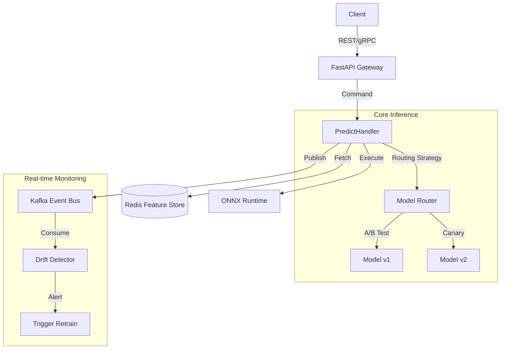

# 🔥 Phoenix ML Platform
> **High-Throughput, Low-Latency Real-time ML Inference System with Self-Healing Capabilities**

[](https://github.com/vtnguyen04/phoenix_ML/actions)
[](https://www.python.org/)
[](https://opensource.org/licenses/MIT)
[](#architecture)

Phoenix ML is a production-grade machine learning inference platform designed for high-availability and real-time observability. It leverages **Domain-Driven Design (DDD)** to decouple complex business logic from infrastructure, ensuring the system is maintainable, scalable, and testable.

---

## 🏗️ Architecture Overview

The system follows a strict 4-layer architecture to ensure **SOLID** and **KISS** principles:

-   **Domain Layer**: Pure business logic, entities (Model, Prediction), and value objects. ZERO external dependencies.
-   **Application Layer**: Orchestrates use cases (Predict, Load Model, Monitor) using the **Command Pattern**.
-   **Infrastructure Layer**: Technology-specific implementations (FastAPI, Redis, Kafka, ONNX Runtime, PostgreSQL).
-   **Shared Kernel**: Common utilities, exceptions, and interfaces.

### System Design


---

## 🚀 Key Features

### 1. High-Performance Inference
-   **ONNX Runtime Integration**: Support for high-performance cross-framework model execution.
-   **A/B Testing & Canary**: Flexible `RoutingStrategy` for seamless model rollouts.
-   **Dynamic Feature Enrichment**: Real-time feature retrieval from **Redis Online Store** with <5ms latency.

### 2. Self-Healing & Observability
-   **Real-time Drift Detection**: Automated statistical monitoring (KS Test) to detect distribution shifts in production data.
-   **Event-Driven Logging**: All inference events are streamed via **Kafka** to **PostgreSQL** for persistence.
-   **Dashboard-as-Code**: Pre-configured **Prometheus & Grafana** dashboards for real-time RPS, Latency, and Drift visualization.

### 3. Professional Frontend
-   **React + TypeScript + Tailwind CSS**: A modern, reactive dashboard for model management and health monitoring.
-   **Real-time Interaction**: Simulate customer profiles and visualize model responses instantly.

---

## 🛠️ Technology Stack

| Category | Tools |
| :--- | :--- |
| **Backend** | FastAPI, Pydantic v2, SQLAlchemy, Asyncio |
| **ML Engine** | ONNX Runtime, Scikit-learn (for demo models) |
| **Streaming** | Apache Kafka (aiokafka) |
| **Data** | PostgreSQL, Redis Cluster |
| **Observability** | Prometheus, Grafana |
| **Frontend** | React, TypeScript, Tailwind CSS, TanStack Query |
| **DevOps** | Docker, Docker Compose, GitHub Actions, Ruff, Mypy |

---

## 🚦 Getting Started

### Prerequisites
-   Docker & Docker Compose
-   Python 3.11+ (recommended)
-   Node.js 20+

### One-Command Deployment (Production Stack)
```bash
docker compose up -d --build
```
This command starts:
-   **ML API**: `http://localhost:8000`
-   **Frontend Dashboard**: `http://localhost:5173`
-   **Grafana**: `http://localhost:3000` (Admin/admin)
-   **Prometheus**: `http://localhost:9090`

### Local Development (Backend)
```bash
# 1. Install dependencies
uv sync

# 2. Train demo models
uv run scripts/train_model.py
uv run scripts/train_challenger.py

# 3. Start API
uv run python -m src.infrastructure.http.fastapi_server
```

---

## 🧪 Quality Assurance

We enforce a 100% pass rate for all quality gates:

```bash
# Linting & Formatting
uv run ruff check .

# Static Type Checking
uv run mypy . --explicit-package-bases

# Unit & Integration Tests
uv run pytest
```

---

## 📁 Repository Structure

```text
.
├── src/                     # Python Source Code
│   ├── domain/              # Core Logic (Entities, Value Objects)
│   ├── application/         # Orchestration (Handlers, Commands)
│   ├── infrastructure/      # Adapters (API, Persistence, Kafka)
│   └── shared/              # Utilities
├── frontend/                # React Dashboard
├── tests/                   # Unit & Integration Test Suite
├── scripts/                 # Simulation & Training Scripts
├── grafana/                 # Monitoring Dashboards & Provisioning
├── Dockerfile               # Backend Docker configuration
└── compose.yaml             # Full-stack Orchestration
```

---

## 👨‍💻 Author
**Võ Thành Nguyễn**
-   **Email**: nguyenvothanh04@gmail.com
-   **GitHub**: [@vtnguyen04](https://github.com/vtnguyen04)
-   **Repository**: [phoenix_ML](https://github.com/vtnguyen04/phoenix_ML.git)