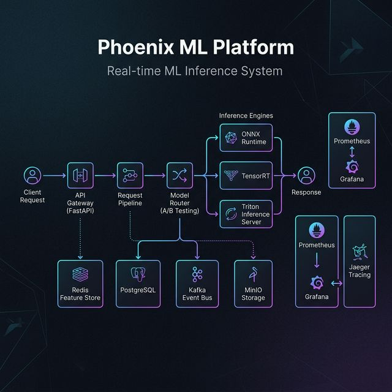
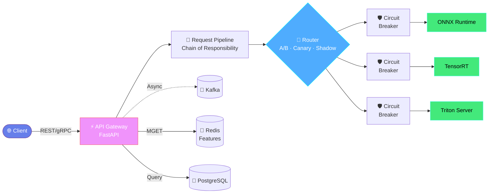
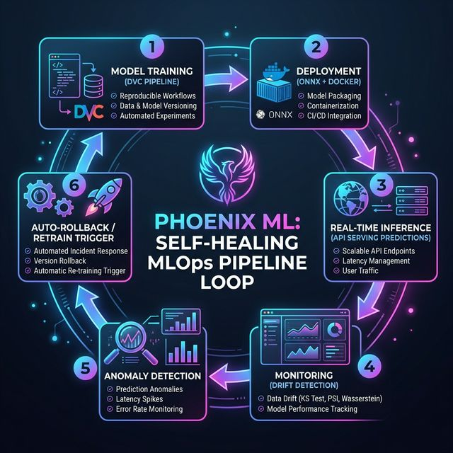
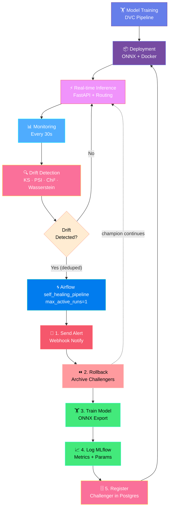
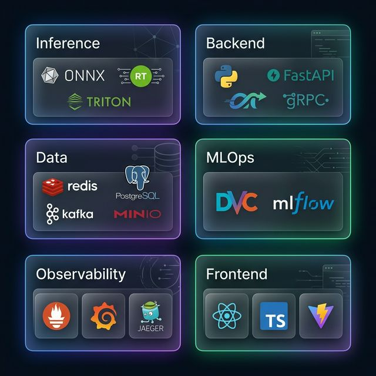

<div align="center">


# Phoenix ML Platform

### High-Throughput, Low-Latency Real-time ML Inference System with Autonomous Self-Healing

[](https://github.com/vtnguyen04/phoenix_ML/actions)
[](https://python.org)
[](https://fastapi.tiangolo.com)
[](https://react.dev)
[](https://onnxruntime.ai)
[](https://docker.com)
[](LICENSE)

**[📖 Documentation](https://vtnguyen04.github.io/phoenix_ML/)** · **[🚀 Quick Start](#-quick-start)** · **[📊 Architecture](#-system-architecture)** · **[🧪 Testing](#-quality-assurance)**

</div>

---

## 📌 What is Phoenix ML?

Phoenix ML is a **production-grade machine learning inference platform** that goes beyond simple model serving. It combines real-time inference with autonomous monitoring, drift detection, and self-healing capabilities — all built with **Domain-Driven Design (DDD)** and **Clean Architecture** principles.

<div align="center">



</div>

### ✨ Key Capabilities

| Capability | Description |
|-----------|-------------|
| ⚡ **Real-time Inference** | Sub-50ms p99 latency with ONNX Runtime, TensorRT, and Triton support |
| 🔄 **Self-Healing** | Drift detection → Airflow pipeline: alert → rollback → retrain → log → deploy |
| 🎯 **A/B Testing** | Dynamic model routing with Champion/Challenger traffic splitting |
| 🛡️ **Circuit Breaker** | Fault tolerance with automatic failover and recovery |
| 📊 **Full Observability** | Prometheus metrics, Grafana dashboards, Jaeger distributed tracing |
| 🔬 **Anomaly Detection** | Real-time monitoring for prediction anomalies, latency spikes, error rates |
| 📦 **DVC Pipelines** | Reproducible model training with versioned data and artifacts |
| 🌀 **Airflow Orchestration** | 5-task self-healing DAG with max_active_runs=1 deduplication |

---

## 🏗️ System Architecture

### Inference Pipeline


```mermaid
graph LR
    Client([🌐 Client]) -->|REST/gRPC| Gateway[⚡ API Gateway<br/>FastAPI]
    Gateway --> Pipeline[🔗 Request Pipeline<br/>Chain of Responsibility]
    Pipeline --> Router{🎯 Router<br/>A/B · Canary · Shadow}

    Router --> CB1[🛡️ Circuit<br/>Breaker]
    CB1 --> ONNX[ONNX Runtime]

    Router --> CB2[🛡️ Circuit<br/>Breaker]
    CB2 --> TRT[TensorRT]

    Router --> CB3[🛡️ Circuit<br/>Breaker]
    CB3 --> Triton[Triton Server]

    Gateway -.->|Async| Kafka[(📨 Kafka)]
    Gateway -->|MGET| Redis[(🔴 Redis<br/>Features)]
    Gateway -->|Query| PG[(🐘 PostgreSQL)]

    style Client fill:#667eea,stroke:#764ba2,color:#fff
    style Gateway fill:#f093fb,stroke:#f5576c,color:#fff
    style Router fill:#4facfe,stroke:#00f2fe,color:#fff
    style ONNX fill:#43e97b,stroke:#38f9d7,color:#000
    style TRT fill:#43e97b,stroke:#38f9d7,color:#000
    style Triton fill:#43e97b,stroke:#38f9d7,color:#000
```

### Self-Healing MLOps Loop

<div align="center">



</div>


```mermaid
graph TD
    Train["🏋️ Model Training<br/>DVC Pipeline"] --> Deploy["📦 Deployment<br/>ONNX + Docker"]
    Deploy --> Serve["⚡ Real-time Inference<br/>FastAPI + Routing"]
    Serve --> Monitor["📊 Monitoring<br/>Every 30s"]
    Monitor --> Anomaly["🔍 Drift Detection<br/>KS · PSI · Chi² · Wasserstein"]
    Anomaly --> Decision{"Drift<br/>Detected?"}
    Decision -->|No| Serve
    Decision -->|"Yes (deduped)"| Airflow["🌀 Airflow self_healing_pipeline<br/>max_active_runs=1"]
    Airflow --> T1["🚨 1. Send Alert<br/>Webhook Notify"]
    T1 --> T2["⏪ 2. Rollback<br/>Archive Challengers"]
    T2 --> T3["🏋️ 3. Train Model<br/>ONNX Export"]
    T3 --> T4["📈 4. Log MLflow<br/>Metrics + Params"]
    T4 --> T5["🗄️ 5. Register<br/>Challenger in Postgres"]
    T5 --> Deploy
    T2 -.->|champion continues| Serve

    style Train fill:#667eea,stroke:#764ba2,color:#fff
    style Deploy fill:#764ba2,stroke:#667eea,color:#fff
    style Serve fill:#f093fb,stroke:#f5576c,color:#fff
    style Monitor fill:#4facfe,stroke:#00f2fe,color:#fff
    style Anomaly fill:#fa709a,stroke:#fee140,color:#fff
    style Decision fill:#ffecd2,stroke:#fcb69f,color:#000
    style Airflow fill:#017cee,stroke:#00c7b7,color:#fff
    style T1 fill:#f5576c,stroke:#ff6b6b,color:#fff
    style T2 fill:#ff9a9e,stroke:#fad0c4,color:#000
    style T3 fill:#43e97b,stroke:#38f9d7,color:#000
    style T4 fill:#43e97b,stroke:#38f9d7,color:#000
    style T5 fill:#fa709a,stroke:#fee140,color:#fff
```

---

## 📓 Interactive Notebooks

Explore the platform hands-on with our demo notebooks:

| Notebook | Description |
|----------|-------------|
| [01 — Inference Demo](notebooks/01_inference_demo.ipynb) | Real-time predictions, latency benchmarks (p50/p95/p99) |
| [02 — Drift Detection](notebooks/02_drift_detection_demo.ipynb) | KS test, PSI, Wasserstein distance with visualization |
| [03 — Self-Healing](notebooks/03_self_healing_demo.ipynb) | Trigger Airflow DAG, monitor tasks, verify new model |
| [04 — A/B Testing](notebooks/04_ab_testing_demo.ipynb) | Champion/Challenger lifecycle, rollback, traffic simulation |

---

## 🛠️ Tech Stack

<div align="center">



</div>

| Layer | Technologies |
|-------|-------------|
| **Inference** | ONNX Runtime · TensorRT · Triton Inference Server |
| **Backend** | Python 3.11+ · FastAPI · gRPC · Pydantic v2 · SQLAlchemy Async |
| **Data** | Redis (features) · PostgreSQL (metadata) · Apache Kafka (events) · MinIO/S3 (artifacts) |
| **MLOps** | DVC (data versioning) · MLflow (experiment tracking) · Apache Airflow (orchestration) · Scikit-Learn |
| **Observability** | Prometheus · Grafana · Jaeger (OpenTelemetry) |
| **Frontend** | React 18 · TypeScript · Vite · Vanilla CSS · Vitest |
| **Infrastructure** | Docker · Kubernetes (Helm) · GitHub Actions CI/CD · `uv` package manager |

---

## 🏛️ Architecture & Design Patterns

### Clean Architecture (DDD)

```
src/
├── domain/                    # 🧠 Pure business logic (zero framework deps)
│   ├── inference/             #    Model, Prediction, InferenceEngine interface
│   ├── feature_store/         #    FeatureRegistry, FeatureStore interface
│   ├── model_registry/        #    ModelRepository, ArtifactStorage interface
│   └── monitoring/            #    DriftReport, DriftCalculator, AnomalyDetector
│
├── application/               # 🎯 Use-case orchestration (CQRS)
│   ├── commands/              #    PredictCommand, LoadModelCommand, TriggerRetrainCommand
│   ├── handlers/              #    PredictHandler, QueryHandlers
│   └── services/              #    MonitoringService
│
├── infrastructure/            # 🔌 Framework adapters
│   ├── http/                  #    FastAPI, gRPC, Routes, DI Container
│   ├── ml_engines/            #    ONNX, TensorRT, Triton implementations
│   ├── feature_store/         #    Redis, Parquet, InMemory
│   ├── persistence/           #    Postgres, MLflow, InMemory repos
│   ├── messaging/             #    Kafka Producer/Consumer
│   ├── monitoring/            #    Prometheus, Jaeger, Alert Notifier
│   └── artifact_storage/      #    S3 (MinIO), Local
│
└── shared/                    # 🔧 Cross-cutting utilities
```

### Design Patterns Implemented

| Pattern | Implementation | Purpose |
|---------|---------------|---------|
| **Strategy** | `RoutingStrategy` (ABTesting, Canary, Shadow) | Dynamic model traffic routing |
| **Circuit Breaker** | `CircuitBreaker` (Closed → Open → Half-Open) | Fault tolerance & auto-recovery |
| **Chain of Responsibility** | `RequestPipeline` (Validate → Cache → Feature → Infer) | Composable request processing |
| **Command/CQRS** | `PredictCommand` → `PredictHandler` | Separate read/write concerns |
| **Repository** | `ModelRepository`, `FeatureStore` | Data access abstraction |
| **Observer** | Kafka event bus | Async event propagation |
| **Dependency Injection** | `Container` class | Framework decoupling |

---

## 🚀 Quick Start

### Docker Compose (Full Stack — 13+ Services)

```bash
# Clone and start everything
git clone https://github.com/vtnguyen04/phoenix_ML.git
cd phoenix_ML

# Start core services (API, DB, Redis, Kafka, MLflow, Grafana, etc.)
docker compose up -d --build

# Start Airflow orchestration services
docker compose -f docker-compose.airflow.yaml up -d

# Train the model via DVC
uv run dvc repro

# Seed feature store
uv run python scripts/seed_features.py
```

| Service | URL | Purpose |
|---------|-----|---------|
| 🔗 **API** | http://localhost:8001 | ML inference + monitoring |
| 🖥️ **Dashboard** | http://localhost:5174 | React control plane |
| 📊 **Grafana** | http://localhost:3001 | Metrics visualization |
| 📈 **Prometheus** | http://localhost:9091 | Metrics collection |
| 💾 **MinIO** | http://localhost:9001 | Model artifact storage |
| 🔍 **Jaeger** | http://localhost:16686 | Distributed tracing |
| 🌀 **Airflow** | http://localhost:8080 | Pipeline orchestration (admin/admin) |
| 📈 **MLflow** | http://localhost:5000 | Experiment tracking |

### Make a Prediction

```bash
# Via entity ID (features from Redis)
curl -X POST http://localhost:8001/api/predict \
  -H "Content-Type: application/json" \
  -d '{"model_id": "credit-risk", "entity_id": "customer-good"}'

# Via raw features
curl -X POST http://localhost:8001/api/predict \
  -H "Content-Type: application/json" \
  -d '{"model_id": "credit-risk", "features": [0.5, 0.3, 0.8, ...]}'
```

### Local Development

```bash
# Install dependencies
uv sync

# Run API server
uv run python -m src.infrastructure.http.fastapi_server

# Run frontend
cd frontend && npm install && npm run dev
```

---

## 🧪 Quality Assurance

### Test Coverage

| Suite | Tests | Coverage | Framework |
|-------|-------|----------|-----------|
| **Backend Unit** | 189 | 89% | Pytest + pytest-cov |
| **Backend Integration** | 10+ | — | Pytest + httpx |
| **Backend E2E** | 5+ | — | Pytest |
| **Frontend** | 96 | — | Vitest + React Testing Library |
| **Total** | **243+** | — | — |

### CI/CD Pipeline

```bash
# Backend quality gates
uv run ruff check .                       # Linting
uv run mypy . --explicit-package-bases    # Type checking
uv run pytest tests/ --cov=src            # Tests + coverage

# Frontend quality gates
cd frontend && npx vitest run             # Component tests
```

---

## 📊 Benchmarking

```bash
# Latency benchmark — measures p50/p95/p99
uv run python benchmarks/latency_benchmark.py --requests 500 --concurrency 20

# Throughput benchmark — measures RPS under load
uv run python benchmarks/throughput_benchmark.py --duration 10 --concurrency 10

# Locust load test — interactive web UI
pip install locust
locust -f benchmarks/locustfile.py --host http://localhost:8001
# Open http://localhost:8089
```

---

## 📁 Repository Structure

```
phoenix-ml-platform/
├── src/                         # Backend (DDD layers)
├── frontend/                    # React + TypeScript dashboard
├── dags/                        # Airflow DAGs (self_healing_pipeline)
├── tests/                       # Unit / Integration / E2E
│   ├── unit/                    # 130+ isolated tests
│   ├── integration/             # API + DB boundary tests
│   └── e2e/                     # Full pipeline tests
├── scripts/                     # Training & seeding pipelines
├── benchmarks/                  # Latency, throughput, Locust
├── deploy/helm/                 # Kubernetes Helm charts
├── grafana/                     # Provisioned dashboards
├── docs/                        # Architecture, ADRs, API reference
│   ├── architecture/            # System design + DDD overview
│   ├── adr/                     # 5 Architecture Decision Records
│   ├── api/                     # REST API reference
│   ├── deployment/              # Docker stack guide
│   └── frontend/                # Frontend architecture
├── .github/workflows/           # CI/CD pipelines
├── dvc.yaml                     # ML pipeline stages
├── compose.yaml                 # Core services Docker stack
├── docker-compose.airflow.yaml  # Airflow orchestration stack
├── Dockerfile.airflow           # Custom Airflow image with ML deps
└── pyproject.toml               # Python dependencies
```

---

## 📜 Architecture Decision Records

| ADR | Decision | Rationale |
|-----|----------|-----------|
| [001](docs/adr/001-use-ddd-architecture.md) | DDD + Clean Architecture | Testability, flexibility, maintainability |
| [002](docs/adr/002-use-onnx-runtime.md) | ONNX Runtime standardization | Framework-agnostic, 2-10x inference speedup |
| [003](docs/adr/003-use-kafka-for-event-streaming.md) | Kafka for event streaming | Decouple inference from logging, durability |
| [004](docs/adr/004-observability-with-prometheus-grafana.md) | Prometheus + Grafana | Real-time metrics, dashboard-as-code |
| [005](docs/adr/005-dvc-data-versioning.md) | DVC + MinIO | Reproducible pipelines, S3-compatible storage |

---

## 🤝 Contributing

```bash
# Fork → Branch → Commit → Push → PR
git checkout -b feature/your-feature
git commit -m "feat(scope): description"
git push origin feature/your-feature
```

**Branch naming**: `feature/`, `fix/`, `docs/`, `refactor/`
**Commit style**: [Conventional Commits](https://www.conventionalcommits.org/)

---

<div align="center">

## 👤 Author

**Võ Thành Nguyễn**

[](https://github.com/vtnguyen04)
[](mailto:nguyenvothanh04@gmail.com)

---

*Built with ❤️ using DDD, SOLID, and a passion for production-grade ML systems*

</div>
