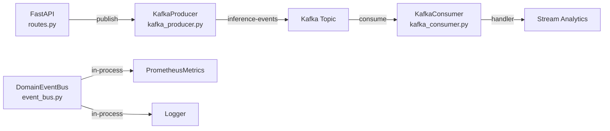

# ADR 003: Asynchronous Event Streaming with Apache Kafka

## Status
✅ **Accepted** — March 2026

## Context

ML inference platform generates high-volume events: predictions, drift detections, model updates, training completions. These events cần được xử lý async để không block main inference path.

### Vấn đề

- Synchronous processing: prediction logging → tăng latency
- Tight coupling: inference service trực tiếp gọi monitoring service
- Single point of failure: nếu logger chết → inference cũng chết
- Scale vertically only: tất cả processing trên 1 process

## Decision

Sử dụng **Apache Kafka** (KRaft mode, no Zookeeper) cho async event streaming.

### Event Flow



### Implementation Details

**Producer** (`kafka_producer.py`):
- `AIOKafkaProducer` (async)
- JSON serialization
- No-op fallback khi Kafka offline → development/CI không cần Kafka

**Consumer** (`kafka_consumer.py`):
- `AIOKafkaConsumer` (async)
- Consumer group: `phoenix-ml-consumers`
- Per-message error handling (1 message lỗi ≠ crash cả consumer)
- Auto-commit offsets
- No-op fallback

**Topics**:
- `inference-events` — prediction results, latency, model info

### Kafka Configuration (Docker)

```yaml
kafka:
  image: apache/kafka:latest
  environment:
    KAFKA_NODE_ID: 1
    KAFKA_PROCESS_ROLES: broker,controller
    KAFKA_CONTROLLER_QUORUM_VOTERS: 1@kafka:9093
    KAFKA_LISTENERS: PLAINTEXT://:9092,CONTROLLER://:9093,EXTERNAL://:9094
  # KRaft mode — no Zookeeper needed
```

### DomainEventBus vs Kafka

| Feature | DomainEventBus | Kafka |
|---------|---------------|-------|
| Scope | In-process (synchronous) | Cross-process (async) |
| Use case | Prometheus metrics, logging | Prediction logging, analytics |
| Durability | None (RAM only) | Persistent (disk) |
| Scaling | Single process | Horizontal (consumer groups) |

## Consequences

### Positive
- ✅ Inference latency not affected by downstream processing
- ✅ Horizontal scaling via consumer groups
- ✅ Event replay: re-process events khi fix bugs
- ✅ Decoupled services: producer/consumer evolve independently
- ✅ KRaft mode: simpler deployment (no Zookeeper)

### Negative
- ❌ Additional infrastructure (Kafka broker)
- ❌ Eventual consistency: events may arrive with delay
- ❌ Monitoring Kafka cluster health separately
- ❌ Development complexity: need to handle message serialization

### Mitigations
- **No-op fallback**: Platform works without Kafka (events silently dropped)
- **Kafka UI**: provectuslabs/kafka-ui at port 8082 for visual management
