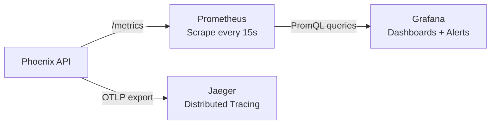

# ADR 004: Unified Observability with Prometheus and Grafana

## Status
✅ **Accepted** — March 2026

## Context

ML inference system cần monitoring toàn diện: prediction latency, throughput, model accuracy, data drift, error rates. Cần alert khi metrics vượt ngưỡng.

### Vấn đề
- Không có visibility vào model performance in production
- Không biết khi nào data drift xảy ra
- Không detect được latency spikes hay error rate increases
- Manual monitoring = human bottleneck

## Decision

Sử dụng **Prometheus** (metrics collection) + **Grafana** (visualization) + **Jaeger** (distributed tracing).

### Observability Stack



### Metrics Published

| Metric | Type | Labels | Mục đích |
|--------|------|--------|----------|
| `phoenix_prediction_count` | Counter | `model_id`, `version` | Total predictions |
| `phoenix_inference_latency_ms` | Histogram | `model_id` | Latency distribution (p50/p95/p99) |
| `phoenix_model_confidence` | Histogram | `model_id` | Confidence score distribution |
| `phoenix_drift_score` | Gauge | `model_id` | Current drift score |
| `phoenix_drift_detected_total` | Counter | `model_id` | Drift detection count |
| `phoenix_model_accuracy` | Gauge | `model_id` | Model accuracy |
| `phoenix_model_f1_score` | Gauge | `model_id` | Model F1 score |
| `phoenix_model_rmse` | Gauge | `model_id` | Regression RMSE |
| `phoenix_model_mae` | Gauge | `model_id` | Regression MAE |
| `phoenix_model_r2` | Gauge | `model_id` | Regression R² |
| `phoenix_model_primary_metric` | Gauge | `model_id`, `task_type` | Primary metric per model |

### Implementation

**PrometheusMetricsPublisher** (`prometheus_metrics_publisher.py`):
- Implement domain `MetricsPublisher` ABC
- Subscribe to `DomainEventBus` events:
  - `PredictionCompleted` → increment counter, record latency
  - `DriftScorePublished` → set drift gauge
  - `ModelRetrained` → update accuracy/f1 gauges

**OpenTelemetry Tracing** (`tracing.py`):
- `TracerProvider` with OTLP exporter → Jaeger collector
- Traces: request → handler → engine → response with span attributes

**AlertNotifier** (`alert_notifier.py`):
- Webhook-based: POST JSON payload to Slack/Discord/custom URL
- Slack-compatible blocks format

### Grafana Auto-provisioning

```
grafana/
├── provisioning/
│   ├── datasources/datasource.yml    # Prometheus URL
│   └── dashboards/provider.yml       # Dashboard file location
└── dashboards/
    └── phoenix-ml.json               # Pre-built dashboard panels
```

## Consequences

### Positive
- ✅ Real-time visibility: latency, throughput, drift
- ✅ Auto-provisioned dashboards (zero manual config)
- ✅ PromQL alerts: Grafana can alert on any metric condition
- ✅ Distributed tracing: debug slow requests end-to-end
- ✅ Industry standard: Prometheus + Grafana widely adopted

### Negative
- ❌ 3 additional containers (Prometheus, Grafana, Jaeger)
- ❌ Storage: Prometheus TSDB grows with retention period
- ❌ Learning curve: PromQL query language
