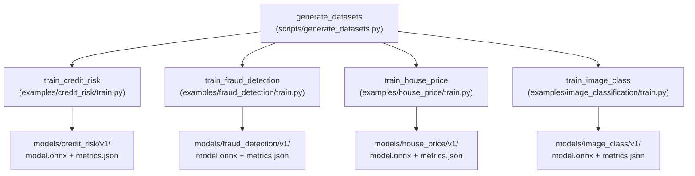

# ADR 005: DVC for Data and Model Versioning

## Status
✅ **Accepted** — March 2026

## Context

ML projects cần version control cho data và model artifacts — files quá lớn cho Git. Cần reproducibility: anyone clone repo có thể reproduce exact results.

### Vấn đề
- Datasets (CSV, NPZ) thay đổi theo thời gian → cần version history
- Model files (ONNX) lớn → không thể commit vào Git
- Training scripts cần track dependencies: data changes → retrain
- Team cần reproduce experiments: same data + code = same model

## Decision

Sử dụng **DVC (Data Version Control)** cho data và model versioning.

### Pipeline Definition (dvc.yaml)

```yaml
stages:
  generate_datasets:
    cmd: uv run python scripts/generate_datasets.py
    outs:
      - data/credit_risk/dataset.csv
      - data/fraud_detection/dataset.csv
      - data/house_price/dataset.csv
      - data/image_class/dataset.npz

  train_credit_risk:
    cmd: uv run python examples/credit_risk/train.py
    deps:
      - data/credit_risk/dataset.csv
      - examples/credit_risk/train.py
    outs:
      - models/credit_risk/v1/

  train_fraud_detection:
    cmd: uv run python examples/fraud_detection/train.py
    deps:
      - data/fraud_detection/dataset.csv
    outs:
      - models/fraud_detection/v1/

  train_house_price:
    cmd: uv run python examples/house_price/train.py
    deps:
      - data/house_price/dataset.csv
    outs:
      - models/house_price/v1/

  train_image_class:
    cmd: uv run python examples/image_classification/train.py
    deps:
      - data/image_class/dataset.npz
    outs:
      - models/image_class/v1/
```

### Usage

```bash
# Run full pipeline (skip unchanged stages)
uv run dvc repro

# Run specific stage
uv run dvc repro train_credit_risk

# Show pipeline DAG
uv run dvc dag

# Push artifacts to remote (MinIO)
uv run dvc push

# Pull artifacts
uv run dvc pull
```

### Pipeline DAG



### DVC + Git Workflow

```
Git tracks:       .dvc files (small pointers), dvc.yaml, dvc.lock
DVC tracks:       data/*.csv, data/*.npz, models/**/*.onnx
Remote storage:   MinIO (s3://phoenix-ml/)
```

## Consequences

### Positive
- ✅ Full reproducibility: `git checkout <commit> && dvc checkout && dvc repro`
- ✅ Lightweight Git: only pointers, not actual data files
- ✅ Pipeline DAG: automatic dependency tracking → skip unchanged stages
- ✅ MinIO remote: team-wide artifact sharing
- ✅ CI integration: `dvc repro` in GitHub Actions

### Negative
- ❌ Learning curve: DVC concepts (stages, deps, outs, remotes)
- ❌ Additional tool: `dvc` CLI needed
- ❌ Lock file conflicts: `dvc.lock` can have merge conflicts
