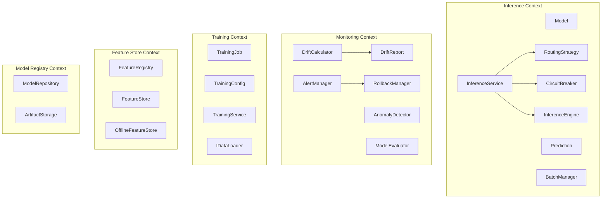

# DDD Architecture Overview: Phoenix ML Platform

## Overview

Phoenix ML is built with **Domain-Driven Design (DDD)** combined with **Clean Architecture** and **CQRS** (Command Query Responsibility Segregation).

### Why DDD?

| Reason | Explanation |
|--------|-------------|
| **Complexity Management** | ML platform has many complex bounded contexts (Inference, Monitoring, Training, Feature Store) |
| **Framework Independence** | Domain logic does NOT depend on FastAPI, SQLAlchemy, or any framework — easy to test and replace |
| **Ubiquitous Language** | Class and method names reflect domain language: `Model`, `Prediction`, `DriftReport`, `RoutingStrategy` |
| **Modularity** | Each bounded context can be developed, tested, and deployed independently |

## Bounded Contexts

Phoenix ML has **5 Bounded Contexts**, each managing a specific subdomain:



### Context Map

| Bounded Context | Responsibility | Entities | Key Services |
|----------------|----------------|----------|-------------|
| **Inference** | Real-time ML prediction | Model, Prediction | InferenceService, BatchManager, RoutingStrategy, CircuitBreaker, RequestPipeline |
| **Monitoring** | Drift detection + alerting | DriftReport | DriftCalculator, AlertManager, AnomalyDetector, RollbackManager, ModelEvaluator |
| **Training** | Model training management | TrainingJob, TrainingConfig | TrainingService, IDataLoader, ITrainer, HyperparameterOptimizer |
| **Feature Store** | Feature management | FeatureRegistry | FeatureStore (online), OfflineFeatureStore (batch) |
| **Model Registry** | Model versioning + artifacts | — | ModelRepository, ArtifactStorage |

## Tactical Patterns

### Entities

Entities have a **unique identity** (ID) and a **lifecycle** (mutable state).

```python
# phoenix_ml/domain/inference/entities/model.py
@dataclass
class Model:
    id: str              # "credit-risk"
    version: str         # "v1"
    uri: str             # "local:///models/credit_risk/v1/model.onnx"
    framework: str       # "onnx"
    metadata: dict       # {"role": "champion", "metrics": {...}}
    is_active: bool      # True (champion/challenger) / False (archived)
    created_at: datetime
    
    @property
    def unique_key(self) -> str:
        return f"{self.id}:{self.version}"
    
    @property
    def stage(self) -> ModelStage:
        role = self.metadata.get("role", "development")
        return ModelStage(role)
```

```python
# phoenix_ml/domain/monitoring/entities/drift_report.py
@dataclass
class DriftReport:
    model_id: str
    feature_name: str
    method: str          # "ks", "psi", "chi2"
    score: float         # 0.0 - 1.0
    is_drifted: bool     # score > threshold
    threshold: float
    timestamp: datetime
```

```python
# phoenix_ml/domain/training/entities/training_job.py
@dataclass
class TrainingJob:
    job_id: str
    model_id: str
    status: str          # PENDING → RUNNING → COMPLETED/FAILED
    started_at: datetime | None
    finished_at: datetime | None
    metrics: dict        # {"accuracy": 0.95, "f1_score": 0.93}
```

### Value Objects

Value Objects are **immutable** and compared by value (not by reference).

```python
# phoenix_ml/domain/inference/value_objects/confidence_score.py
@dataclass(frozen=True)
class ConfidenceScore:
    value: float  # Must be in [0.0, 1.0]
    
    def __post_init__(self):
        if not 0.0 <= self.value <= 1.0:
            raise ValueError(f"Confidence must be 0-1, got {self.value}")

# phoenix_ml/domain/inference/value_objects/feature_vector.py
@dataclass(frozen=True)
class FeatureVector:
    values: np.ndarray  # float32 array
    
    @property
    def dimension(self) -> int:
        return len(self.values)

# phoenix_ml/domain/inference/value_objects/model_version.py
@dataclass(frozen=True)
class ModelVersion:
    major: int
    minor: int = 0
    
    @classmethod
    def parse(cls, version_str: str) -> "ModelVersion":
        # "v1" → ModelVersion(1, 0)
        # "v2.1" → ModelVersion(2, 1)
```

### Domain Services

Domain services contain business logic that **does not belong to any single entity**.

```python
# phoenix_ml/domain/inference/services/inference_service.py
class InferenceService:
    """Orchestrates the prediction flow."""
    
    async def predict(self, model: Model, features: FeatureVector) -> Prediction:
        # 1. Check circuit breaker
        # 2. Load model if needed
        # 3. Run inference
        # 4. Record latency
        return Prediction(...)

# phoenix_ml/domain/monitoring/services/drift_calculator.py
class DriftCalculator:
    """Calculates statistical drift between distributions."""
    
    def calculate_ks(self, reference: list[float], current: list[float]) -> DriftResult:
        """Kolmogorov-Smirnov test."""
        stat, p_value = ks_2samp(reference, current)
        return DriftResult(score=stat, is_drifted=stat > threshold)
    
    def calculate_psi(self, reference, current) -> DriftResult:
        """Population Stability Index."""
    
    def calculate_chi2(self, reference, current) -> DriftResult:
        """Chi-squared test for categorical features."""
```

### Repository Interfaces (ABCs)

Repositories are abstract interfaces defined in the domain layer — concrete implementations live in infrastructure.

```python
# phoenix_ml/domain/model_registry/repositories/model_repository.py
class ModelRepository(ABC):
    @abstractmethod
    async def save(self, model: Model) -> None: ...
    
    @abstractmethod
    async def get_by_id(self, model_id: str, version: str) -> Model | None: ...
    
    @abstractmethod
    async def get_champion(self, model_id: str) -> Model | None: ...
    
    @abstractmethod
    async def update_stage(self, model_id: str, version: str, stage: str) -> None: ...
    
    @abstractmethod
    async def list_all(self) -> list[Model]: ...

# Implementations (infrastructure layer):
# - PostgresModelRegistry  → PostgreSQL
# - MlflowModelRegistry    → MLflow API
# - InMemoryModelRepository → dict (testing)
```

```python
# phoenix_ml/domain/feature_store/repositories/feature_store.py
class FeatureStore(ABC):
    @abstractmethod
    async def get_online_features(self, entity_id: str, feature_names: list[str]) -> list[float]: ...
    
    @abstractmethod
    async def add_features(self, entity_id: str, features: dict[str, float]) -> None: ...

# Implementations:
# - RedisFeatureStore       → Redis HMGET/HSET
# - InMemoryFeatureStore    → dict
```

## CQRS Pattern

Commands (write) and Queries (read) are separated:

### Commands (Write Side)

```python
# phoenix_ml/application/commands/predict_command.py
@dataclass
class PredictCommand:
    model_id: str
    model_version: str | None = None
    entity_id: str | None = None
    features: list[float] | None = None

# phoenix_ml/application/commands/batch_predict_command.py
@dataclass
class BatchPredictCommand:
    model_id: str
    batch: list[list[float]]
    model_version: str | None = None
```

### Command Handlers

```python
# phoenix_ml/application/handlers/predict_handler.py
class PredictHandler:
    def __init__(self, model_repo, inference_engine, feature_store, ...):
        ...
    
    async def handle(self, command: PredictCommand) -> Prediction:
        # 1. Resolve model (champion or specific version)
        model = await self._model_repo.get_champion(command.model_id)
        
        # 2. Get features
        if command.entity_id:
            features = await self._feature_store.get_online_features(...)
        else:
            features = FeatureVector(values=np.array(command.features))
        
        # 3. Run inference
        prediction = await self._inference_engine.predict(model, features)
        
        # 4. Publish events
        self._event_bus.publish(PredictionCompleted(...))
        
        return prediction
```

### Query Handlers (Read Side)

```python
# phoenix_ml/application/handlers/query_handlers.py
class GetModelQueryHandler:
    async def handle(self, query: GetModelQuery) -> Model | None:
        return await self._model_repo.get_by_id(query.model_id, query.version)

class GetDriftReportQueryHandler:
    async def handle(self, query: GetDriftReportQuery) -> list[DriftReport]:
        return await self._drift_repo.get_by_model(query.model_id, query.limit)

class GetModelPerformanceQueryHandler:
    async def handle(self, query: GetModelPerformanceQuery) -> dict:
        logs = await self._log_repo.get_recent(query.model_id, limit=100)
        return self._evaluator.evaluate(logs)
```

## Domain Events

Events decouple modules — publishers do not know who the subscribers are.

```python
# phoenix_ml/domain/shared/domain_events.py
@dataclass
class PredictionCompleted:
    model_id: str
    version: str
    status: str          # "success" / "error"
    latency_ms: float
    confidence: float

@dataclass
class DriftDetected:
    model_id: str
    drift_score: float
    method: str

@dataclass
class ModelRetrained:
    model_id: str
    version: str
    metrics: dict
    promoted: bool
```

### Event Bus (Observer Pattern)

```python
# phoenix_ml/domain/shared/event_bus.py
class DomainEventBus:
    def subscribe(self, event_type: type, handler: Callable):
        self._subscribers[event_type].append(handler)
    
    def publish(self, event):
        for handler in self._subscribers[type(event)]:
            handler(event)

# Wiring (container.py):
event_bus = DomainEventBus()
event_bus.subscribe(PredictionCompleted, metrics_publisher.on_prediction)
event_bus.subscribe(DriftScorePublished, metrics_publisher.on_drift_score)
event_bus.subscribe(ModelRetrained, metrics_publisher.on_model_retrained)
```

## Plugin System

Each model can have custom preprocessor/postprocessor:

```python
# phoenix_ml/domain/shared/plugin_registry.py
class PluginRegistry:
    def register_model(self, model_id, preprocessor, postprocessor, data_loader): ...
    def resolve(self, model_id) -> PluginSet: ...

# phoenix_ml/domain/inference/services/processor_plugin.py
class IPreprocessor(ABC):
    @abstractmethod
    def transform(self, raw_input: dict) -> np.ndarray: ...

class IPostprocessor(ABC):
    @abstractmethod
    def transform(self, model_output: np.ndarray, labels: list[str]) -> dict: ...

# Built-in:
# - PassthroughPreprocessor: no-op
# - ClassificationPostprocessor: argmax + class label + probability
```

## Dependency Rule Enforcement

```
✅ domain/        imports only: python stdlib, numpy, dataclasses
✅ application/   imports: domain/
✅ infrastructure/ imports: domain/, application/, third-party libs
❌ domain/        NEVER imports: fastapi, sqlalchemy, redis, kafka, onnxruntime
❌ application/   NEVER imports: infrastructure/
```

This ensures:
- Domain logic can be tested **without** database/Kafka/Redis
- Infrastructure can be swapped (Redis → Memcached, PostgreSQL → MongoDB) **without** modifying domain
- Application layer is the only place that orchestrates domain entities + infrastructure adapters

---
*Document Status: v4.0 — Updated March 2026*
