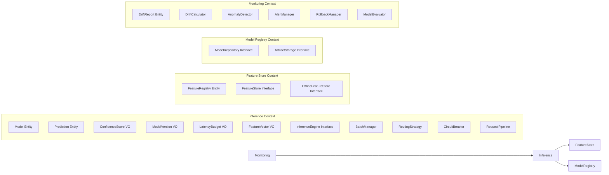

# DDD Architecture Overview: Phoenix ML Platform

## Bounded Contexts



## Domain Layer (Zero Dependencies)

### Entities
| Entity | Location | Aggregate Root | Purpose |
|--------|----------|---------------|---------|
| `Model` | `domain/inference/entities/model.py` | Yes | ML model metadata, version, framework |
| `Prediction` | `domain/inference/entities/prediction.py` | No | Single prediction result + confidence |
| `DriftReport` | `domain/monitoring/entities/drift_report.py` | Yes | Drift detection results |
| `FeatureRegistry` | `domain/feature_store/entities/feature_registry.py` | Yes | Feature definitions + metadata |

### Value Objects (Immutable)
| Value Object | Location | Invariant |
|-------------|----------|-----------|
| `ModelVersion` | `domain/inference/value_objects/model_version.py` | Semantic version string |
| `ConfidenceScore` | `domain/inference/value_objects/confidence_score.py` | Float in [0.0, 1.0] |
| `LatencyBudget` | `domain/inference/value_objects/latency_budget.py` | Positive milliseconds |
| `FeatureVector` | `domain/inference/value_objects/feature_vector.py` | Non-empty float array |

### Domain Events
| Event | Trigger | Consumers |
|-------|---------|-----------|
| `PredictionMade` | After successful inference | Kafka logger, Prometheus metrics |
| `ModelLoaded` | After model initialization | Health check, monitoring |

### Domain Services
| Service | Pattern | Purpose |
|---------|---------|---------|
| `InferenceEngine` | Strategy | Abstract interface → ONNX, TensorRT, Triton |
| `RoutingStrategy` | Strategy | A/B Testing, Canary, Shadow routing |
| `CircuitBreaker` | Circuit Breaker | Fault tolerance (Closed → Open → Half-Open) |
| `RequestPipeline` | Chain of Responsibility | Validation → Cache → Feature → Inference |
| `BatchManager` | — | Dynamic request batching for GPU efficiency |
| `DriftCalculator` | Strategy | KS, PSI, Chi², Wasserstein statistical tests |
| `AnomalyDetector` | — | Prediction anomaly, latency spike, error rate |
| `AlertManager` | Observer | Alert routing + notification |
| `RollbackManager` | — | Auto-rollback with history tracking |
| `ModelEvaluator` | — | Online model performance scoring |

### Repository Interfaces (Domain defines, Infrastructure implements)
| Interface | Implementations |
|-----------|----------------|
| `FeatureStore` | `RedisFeatureStore`, `InMemoryFeatureStore` |
| `OfflineFeatureStore` | `ParquetFeatureStore` |
| `ModelRepository` | `PostgresModelRegistry`, `MLflowModelRegistry`, `InMemoryModelRepo` |
| `ArtifactStorage` | `S3ArtifactStorage`, `LocalArtifactStorage` |
| `DriftReportRepository` | `PostgresDriftRepo` |
| `PredictionLogRepository` | `PostgresLogRepo` |

## Application Layer (Use-Case Orchestration)

### CQRS Pattern
```
Commands (Write)                    Queries (Read)
├── PredictCommand                  ├── GetModelQuery
├── LoadModelCommand                ├── GetDriftReportsQuery
├── TriggerRetrainCommand           └── GetPerformanceQuery
└── SubmitFeedbackCommand
```

### Handlers
| Handler | Input | Output | Orchestrates |
|---------|-------|--------|-------------|
| `PredictHandler` | `PredictCommand` | `PredictionResponse` | FeatureStore → Router → Engine → Logger |
| `MonitoringService` | Model ID | `DriftReport` | DriftCalculator → AlertManager → RollbackManager |

## Infrastructure Layer (Adapters)

### Dependency Inversion
```python
# Domain defines interface:
class FeatureStore(ABC):
    async def get_features(self, entity_id: str) -> list[float]: ...

# Infrastructure implements:
class RedisFeatureStore(FeatureStore):
    async def get_features(self, entity_id: str) -> list[float]:
        return await self.redis.hgetall(f"features:{entity_id}")

# Container wires them:
class Container:
    feature_store: FeatureStore = RedisFeatureStore(redis_client)
```

### Infrastructure Adapters
| Adapter | Technology | Interface |
|---------|-----------|-----------|
| `OnnxEngine` | ONNX Runtime | `InferenceEngine` |
| `TensorRTExecutor` | TensorRT (simulated) | `InferenceEngine` |
| `TritonClient` | Triton Inference Server | `InferenceEngine` |
| `RedisFeatureStore` | Redis | `FeatureStore` |
| `ParquetFeatureStore` | Parquet/DuckDB | `OfflineFeatureStore` |
| `PostgresModelRegistry` | SQLAlchemy + asyncpg | `ModelRepository` |
| `KafkaProducer` | aiokafka | Event publishing |
| `PrometheusMetrics` | prometheus-client | Metrics export |
| `JaegerTracing` | OpenTelemetry | Distributed tracing |
| `AlertNotifier` | HTTP webhooks | Alert delivery |

---
*Updated March 2026*
