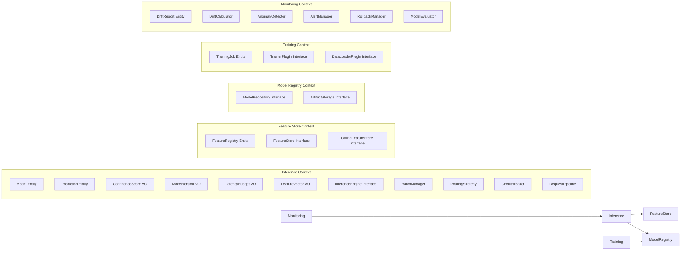

# DDD Architecture Overview: Phoenix ML Platform

## Bounded Contexts



## Domain Layer (Zero Dependencies)

### Entities
| Entity | Location | Aggregate Root | Purpose |
|--------|----------|---------------|---------|
| `Model` | `domain/inference/entities/model.py` | Yes | ML model metadata, version, framework, stage |
| `Prediction` | `domain/inference/entities/prediction.py` | No | Single prediction result + confidence + latency |
| `DriftReport` | `domain/monitoring/entities/drift_report.py` | Yes | Drift detection results (p-value, statistic, method) |
| `FeatureRegistry` | `domain/feature_store/entities/feature_registry.py` | Yes | Feature definitions + metadata |
| `TrainingJob` | `domain/training/entities/training_job.py` | Yes | Training lifecycle (PENDING → RUNNING → COMPLETED) |

### Value Objects (Immutable)
| Value Object | Location | Invariant |
|-------------|----------|-----------|
| `ModelVersion` | `domain/inference/value_objects/model_version.py` | Semantic version string |
| `ConfidenceScore` | `domain/inference/value_objects/confidence_score.py` | Float in [0.0, 1.0] |
| `LatencyBudget` | `domain/inference/value_objects/latency_budget.py` | Positive milliseconds |
| `FeatureVector` | `domain/inference/value_objects/feature_vector.py` | Non-empty float array |

### Domain Events
| Event | Trigger | Consumers |
|-------|---------|-----------|
| `PredictionMade` | After successful inference | Kafka logger, Prometheus metrics |
| `ModelLoaded` | After model initialization | Health check, monitoring |
| `TrainingCompleted` | After training job finishes | Model registry, deployment |
| `DriftDetected` | When statistical drift is confirmed | Airflow self-healing pipeline |

### Domain Services
| Service | Pattern | Purpose |
|---------|---------|---------|
| `InferenceEngine` | Strategy | Abstract interface → ONNX, TensorRT, Triton |
| `InferenceService` | Facade | Orchestrates routing → engine → feature store |
| `RoutingStrategy` | Strategy | A/B Testing, Canary, Shadow, ChampionOnly routing |
| `CircuitBreaker` | Circuit Breaker | Fault tolerance (Closed → Open → Half-Open) |
| `RequestPipeline` | Chain of Responsibility | Validation → Cache → Feature → Inference |
| `BatchManager` | — | Dynamic request batching for GPU efficiency |
| `DriftCalculator` | Strategy | KS, PSI, Chi², Wasserstein statistical tests |
| `AnomalyDetector` | — | Prediction anomaly, latency spike, error rate |
| `AlertManager` | Observer | Alert routing + webhook notification |
| `RollbackManager` | — | Auto-rollback with history tracking |
| `ModelEvaluator` | Strategy | Online model performance (Classification/Regression) |
| `PluginRegistry` | Plugin | Model-agnostic plugin resolution for trainers/loaders |

### Repository Interfaces (Domain defines, Infrastructure implements)
| Interface | Implementations |
|-----------|----------------|
| `FeatureStore` | `RedisFeatureStore`, `InMemoryFeatureStore` |
| `OfflineFeatureStore` | `ParquetFeatureStore` |
| `ModelRepository` | `PostgresModelRegistry`, `MLflowModelRegistry`, `InMemoryModelRepo` |
| `ArtifactStorage` | `S3ArtifactStorage`, `LocalArtifactStorage` |
| `DriftReportRepository` | `PostgresDriftReportRepository` |
| `PredictionLogRepository` | `PostgresPredictionLogRepository` |
| `InferenceEngine` | `ONNXInferenceEngine`, `TensorRTExecutor`, `TritonInferenceClient` |

## Application Layer (Use-Case Orchestration)

### CQRS Pattern
```
Commands (Write)                    Queries (Read)
├── PredictCommand                  ├── GetModelQuery
├── BatchPredictCommand             ├── GetDriftReportQuery
├── LoadModelCommand                └── GetModelPerformanceQuery
├── TriggerRetrainCommand
└── SubmitFeedbackCommand
```

### Handlers
| Handler | Input | Output | Orchestrates |
|---------|-------|--------|-------------|
| `PredictHandler` | `PredictCommand` | `Prediction` | InferenceService → Engine → Prometheus |
| `BatchPredictHandler` | `BatchPredictCommand` | `dict` (aggregated results) | asyncio.gather → PredictHandler × N |
| `MonitoringService` | Model ID | `DriftReport` | DriftCalculator → AlertManager → RollbackManager |
| `GetModelQueryHandler` | `GetModelQuery` | `Model` | ModelRepository lookup |
| `GetDriftReportQueryHandler` | `GetDriftReportQuery` | `list[DriftReport]` | DriftReportRepository lookup |
| `GetModelPerformanceQueryHandler` | `GetModelPerformanceQuery` | `dict` | PredictionLogRepository + ModelEvaluator |

## Infrastructure Layer (Adapters)

### Dependency Inversion
```python
# Domain defines interface:
class FeatureStore(ABC):
    async def get_features(self, entity_id: str) -> list[float]: ...

# Infrastructure implements:
class RedisFeatureStore(FeatureStore):
    async def get_features(self, entity_id: str) -> list[float]:
        raw = await self.redis.lrange(f"features:{entity_id}", 0, -1)
        return [float(v) for v in raw]

# Container wires at startup:
feature_store: FeatureStore
if settings.USE_REDIS:
    feature_store = RedisFeatureStore(redis_url=settings.REDIS_URL)
else:
    feature_store = InMemoryFeatureStore()
```

### Infrastructure Adapters
| Adapter | Technology | Interface |
|---------|-----------|-----------|
| `ONNXInferenceEngine` | ONNX Runtime | `InferenceEngine` |
| `TensorRTExecutor` | TensorRT | `InferenceEngine` |
| `TritonInferenceClient` | Triton Inference Server (gRPC) | `InferenceEngine` |
| `RedisFeatureStore` | Redis (async) | `FeatureStore` |
| `InMemoryFeatureStore` | Python dict | `FeatureStore` |
| `PostgresModelRegistry` | SQLAlchemy 2.0 + asyncpg | `ModelRepository` |
| `MLflowModelRegistry` | MLflow client | `ModelRepository` |
| `S3ArtifactStorage` | boto3 (MinIO/AWS S3) | `ArtifactStorage` |
| `LocalArtifactStorage` | Local filesystem | `ArtifactStorage` |
| `KafkaProducer` | aiokafka | Event publishing |
| `PrometheusMetrics` | prometheus-client | `prediction_count`, `inference_latency`, `model_confidence` |
| `JaegerTracing` | OpenTelemetry SDK + OTLP | Distributed tracing |
| `AlertNotifier` | HTTP webhooks | Alert delivery |

## Shared Layer

| Module | Purpose |
|--------|---------|
| `exceptions/` | `PhoenixBaseError` → `ModelNotFoundError`, `InferenceError`, `FeatureStoreError`, `ValidationError` |
| `interfaces/` | `EventPublisher`, `CacheBackend` |
| `ingestion/` | `DataCollector`, `IngestionService`, `RedisIngestor` |
| `utils/` | `ModelGenerator` (CI/test ONNX model generation) |

---
*Updated March 2026*
