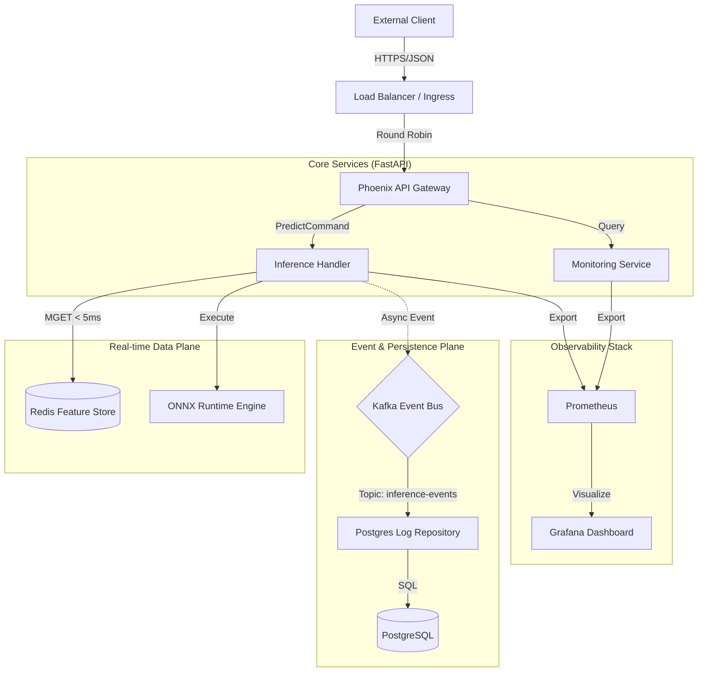
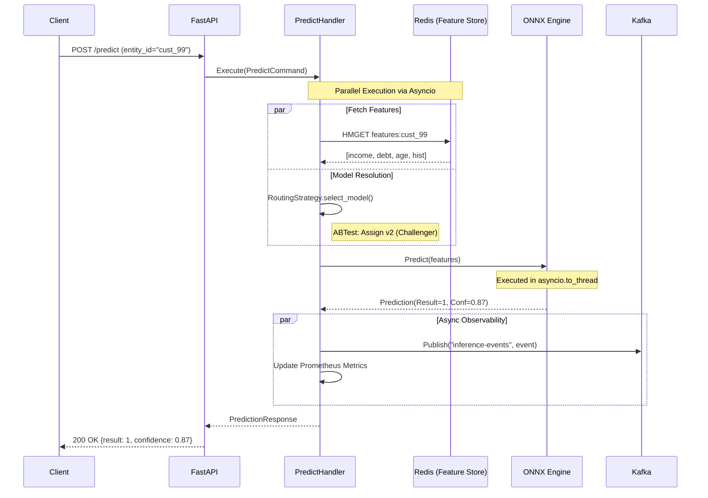
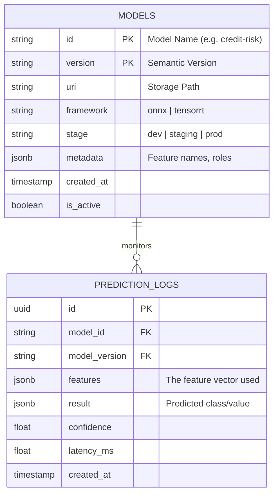

# Detailed System Architecture: Phoenix ML Platform

This document provides an exhaustive technical analysis of the Phoenix ML Platform's architecture, data flow, and component interactions.

## 1. Architectural Philosophy

The platform is built on the **Clean Architecture** paradigm, ensuring that high-level business rules (the Domain) are isolated from low-level implementation details (Infrastructure).

### High-Level Architecture (C4 Level 2)

## 2. Core Workflows

### 2.1. Real-time Inference Pipeline (Sequence Diagram)

The following diagram illustrates the lifecycle of a prediction request, emphasizing the non-blocking nature of the system.

## 3. Data Architecture

### 3.1. Persistence Layer (ER Diagram)

We maintain a strict schema for model metadata and historical inference logs to facilitate reproducible auditing and drift analysis.

## 4. Technical Deep Dive

### 4.1. The Concurrency Model
To maintain sub-50ms p99 latency, Phoenix ML utilizes a hybrid concurrency approach:
-   **I/O Bound**: Redis and Postgres interactions use `async/await` with `asyncio`, allowing thousands of concurrent connections.
-   **CPU Bound**: Inference via ONNX Runtime is compute-heavy and can block the Python event loop (GIL issues). We offload these calls to a dedicated thread pool using `asyncio.to_thread`, ensuring the API remains responsive.

### 4.2. Model Routing & A/B Testing
The `PredictHandler` leverages the **Strategy Pattern**. When a request arrives without a specific version:
1.  It queries the Registry for all `is_active` versions of the model.
2.  It applies the configured `RoutingStrategy` (e.g., `ABTestStrategy` with a 50/50 split).
3.  The routing decision is logged in the `prediction_logs`, enabling comparison of Champion vs. Challenger performance in Grafana.

### 4.3. Self-Healing via Drift Detection
The "Self-Healing" capability is implemented as a continuous loop:
-   **Statistical Engine**: Uses the **Kolmogorov-Smirnov (KS) test** to detect if the distribution of production features deviates significantly from the training baseline.
-   **Automatic Retraining (Trigger)**: Upon detecting drift (p-value < 0.05), the `MonitoringService` issues a system-wide alert. In a full production environment, this event is published to Kafka to trigger an external MLOps pipeline (e.g., Airflow or Kubeflow).

## 5. Error Handling & Resiliency

| Failure Scenario | Mitigation Strategy | Result |
| :--- | :--- | :--- |
| **Redis Down** | Fallback to Raw Features in Request | System remains functional but slower for clients. |
| **Kafka Down** | Retry with Exponential Backoff | Logs are buffered in memory; no data loss for short outages. |
| **Model Load Fail** | ModelRegistry Validation | Returns 404/500 with detailed diagnostic info. |
| **GPU Out-of-Memory** | CPU Fallback in ONNX Runtime | Performance degrades but service stays up. |

---
*Document Status: Verified v1.0*  
*Author: Võ Thành Nguyễn*
