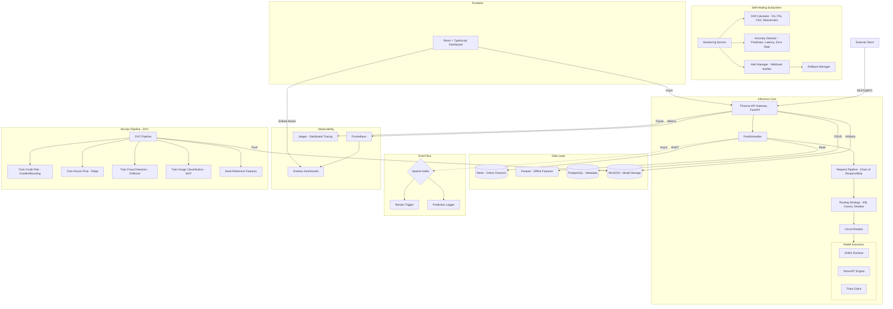
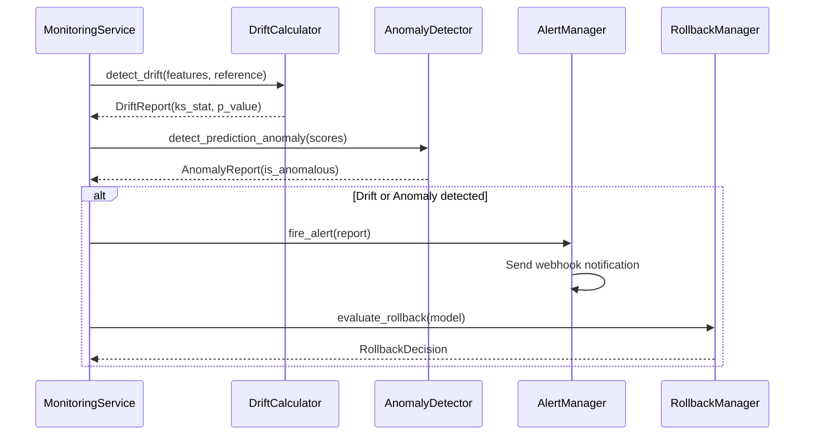

# System Architecture: Phoenix ML Platform

## 1. Overview

Phoenix ML is a self-healing real-time ML inference system built with **Domain-Driven Design (DDD)** and **Clean Architecture**. It provides automated model serving, drift detection, anomaly monitoring, and auto-rollback capabilities.

## 2. Architecture Diagram


```mermaid
graph TD
    Client[External Client] -->|REST/gRPC| API[Phoenix API Gateway - FastAPI]

    subgraph "Inference Core"
        API --> Handler[PredictHandler]
        Handler --> Pipeline[Request Pipeline - Chain of Responsibility]
        Pipeline --> Router[Routing Strategy - A/B, Canary, Shadow]
        Router --> CB[Circuit Breaker]
        CB --> Engines

        subgraph Engines[Model Executors]
            ONNX[ONNX Runtime]
            TRT[TensorRT Engine]
            Triton[Triton Client]
        end
    end

    subgraph "Data Layer"
        Handler -->|MGET| Redis[(Redis - Online Features)]
        Handler -->|Read| Parquet[Parquet - Offline Features]
        API -->|CRUD| Postgres[(PostgreSQL - Metadata)]
        API -->|Artifacts| MinIO[(MinIO/S3 - Model Storage)]
    end

    subgraph "Event Bus"
        Handler -.->|Async| Kafka{Apache Kafka}
        Kafka --> Retrain[Retrain Trigger]
        Kafka --> Logger[Prediction Logger]
    end

    subgraph "Self-Healing Subsystem"
        Monitor[Monitoring Service] --> Drift[Drift Calculator - KS, PSI, Chi2, Wasserstein]
        Monitor --> Anomaly[Anomaly Detector - Prediction, Latency, Error Rate]
        Monitor --> Alert[Alert Manager - Webhook Notifier]
        Alert --> Rollback[Rollback Manager]
    end

    subgraph "Observability"
        API -->|Metrics| Prometheus[Prometheus]
        Prometheus --> Grafana[Grafana Dashboards]
        API -->|Traces| Jaeger[Jaeger - Distributed Tracing]
    end

    subgraph "Frontend"
        Dashboard[React + TypeScript Dashboard]
        Dashboard -->|Fetch| API
        Dashboard -->|Embed iframe| Grafana
    end

    subgraph "MLOps Pipeline - DVC"
        DVC[DVC Pipeline] --> TrainCredit[Train Credit Risk - GradientBoosting]
        DVC --> TrainHouse[Train House Price - Ridge]
        DVC --> TrainFraud[Train Fraud Detection - XGBoost]
        DVC --> TrainImage[Train Image Classification - MLP]
        DVC --> SeedFeatures[Seed Reference Features]
        DVC -->|Push| MinIO
    end
```

## 3. Layer Architecture

```
src/
├── domain/                    # Pure business logic, zero framework deps
│   ├── inference/
│   │   ├── entities/          # Model, Prediction
│   │   ├── value_objects/     # ModelVersion, ConfidenceScore, LatencyBudget, FeatureVector
│   │   ├── services/          # InferenceService, RoutingStrategy, CircuitBreaker,
│   │   │                      # BatchManager, RequestPipeline
│   │   └── events/            # PredictionMade, ModelLoaded
│   ├── feature_store/
│   │   ├── entities/          # FeatureRegistry
│   │   └── repositories/     # FeatureStore, OfflineFeatureStore
│   ├── monitoring/
│   │   ├── entities/          # DriftReport
│   │   ├── services/          # DriftCalculator, AnomalyDetector,
│   │   │                      # AlertManager, RollbackManager, ModelEvaluator
│   │   └── repositories/     # DriftReportRepository, PredictionLogRepository
│   └── model_registry/
│       └── repositories/     # ModelRepository, ArtifactStorage
│
├── application/               # Use-case orchestration (CQRS)
│   ├── commands/              # PredictCommand, BatchPredictCommand, LoadModelCommand
│   ├── handlers/              # PredictHandler, BatchPredictHandler, RetrainHandler, QueryHandlers
│   ├── services/              # MonitoringService
│   └── dto/                   # PredictionRequest, PredictionResponse
│
├── infrastructure/            # Framework adapters
│   ├── http/                  # FastAPI, gRPC, Routes, DI Container
│   ├── ml_engines/            # ONNX, TensorRT, Triton, MockEngine
│   ├── feature_store/         # Redis, Parquet, InMemory
│   ├── persistence/           # Postgres repos, MLflow, InMemory repos
│   ├── messaging/             # Kafka Producer/Consumer
│   ├── monitoring/            # Prometheus metrics, Jaeger tracing, Alert notifier
│   └── artifact_storage/     # S3 (MinIO), Local
│
└── shared/                    # Cross-cutting: ingestion, utilities, interfaces
```

## 4. Design Patterns

| Pattern | Implementation | Purpose |
|---------|---------------|---------|
| Strategy | `RoutingStrategy` (ABTesting, Canary, Shadow) | Model traffic routing |
| Circuit Breaker | `CircuitBreaker` (Closed/Open/Half-Open) | Fault tolerance |
| Chain of Responsibility | `RequestPipeline` (Validation → Cache → Feature → Inference) | Request processing |
| Command/CQRS | `PredictCommand` → `PredictHandler` | Separate read/write concerns |
| Repository | `ModelRepository`, `FeatureStore` | Data access abstraction |
| Observer | Kafka event bus | Async event propagation |
| Dependency Injection | `Container` class | Framework decoupling |

## 5. Self-Healing Flow


```mermaid
sequenceDiagram
    participant Mon as MonitoringService
    participant Drift as DriftCalculator
    participant Anomaly as AnomalyDetector
    participant Alert as AlertManager
    participant Rollback as RollbackManager

    Mon->>Drift: detect_drift(features, reference)
    Drift-->>Mon: DriftReport(ks_stat, p_value)

    Mon->>Anomaly: detect_prediction_anomaly(scores)
    Anomaly-->>Mon: AnomalyReport(is_anomalous)

    alt Drift or Anomaly detected
        Mon->>Alert: fire_alert(report)
        Alert->>Alert: Send webhook notification
        Mon->>Rollback: evaluate_rollback(model)
        Rollback-->>Mon: RollbackDecision
    end
```

## 6. Infrastructure Services

| Service | Technology | Port | Purpose |
|---------|-----------|------|---------|
| API | FastAPI + Uvicorn | 8001 | ML inference + monitoring REST API |
| Frontend | React + Vite | 5174 | Dashboard with Grafana embed |
| Redis | Redis Alpine | 6380 | Online feature store |
| PostgreSQL | Postgres 15 | 5433 | Model metadata + prediction logs |
| Kafka | Apache Kafka (KRaft) | 9094 | Async event streaming |
| Prometheus | Prometheus | 9091 | Metrics collection |
| Grafana | Grafana | 3001 | Metrics visualization |
| MinIO | MinIO | 9000/9001 | S3-compatible artifact storage (DVC remote) |
| Jaeger | Jaeger | 16686 | Distributed tracing |

## 7. Test Coverage

- **Backend**: 195+ source files, 50+ test files, all CI checks pass (Ruff, mypy, pytest)
- **Frontend**: 96 tests (Vitest + React Testing Library)
- **CI**: GitHub Actions with Ruff, Mypy, pytest, vitest

---
*Document Status: v2.0 — Updated March 2026*
