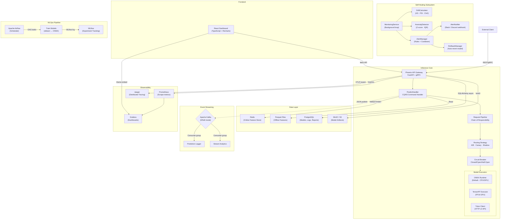
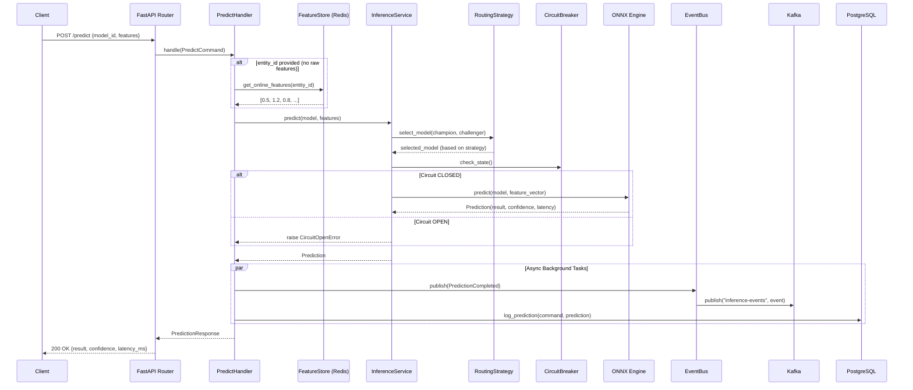
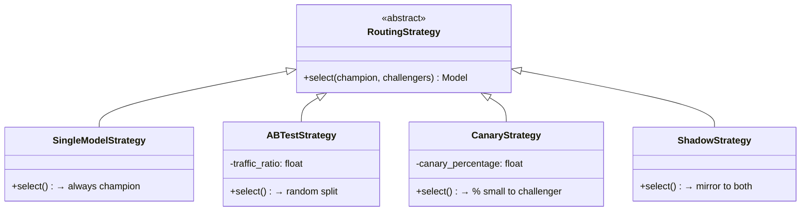
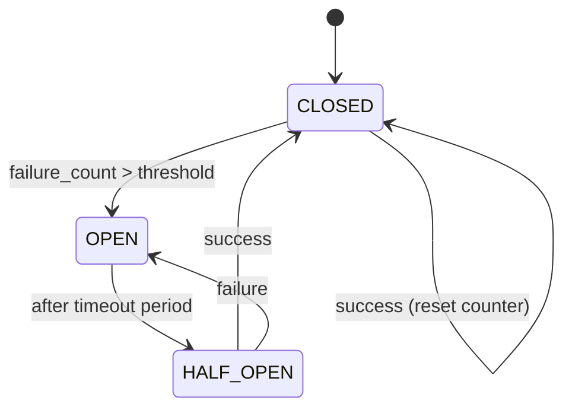

# System Architecture: Phoenix ML Platform

## 1. Tổng quan

Phoenix ML là hệ thống **MLOps end-to-end** xây dựng theo **Domain-Driven Design (DDD)** và **Clean Architecture**. Hệ thống cung cấp:

- Real-time ML inference (REST + gRPC)
- Tự động phát hiện data drift và anomaly
- Self-healing: alert → rollback → retrain
- Multi-model serving với A/B testing, canary deployment
- Full observability stack (metrics, tracing, logging)

## 2. Architecture Diagram

### 2.1 Overall System Architecture


```mermaid
graph TD
    Client[External Client] -->|REST/gRPC| API[Phoenix API Gateway<br/>FastAPI + gRPC]

    subgraph "Inference Core"
        API --> Handler[PredictHandler<br/>CQRS Command Handler]
        Handler --> Pipeline[Request Pipeline<br/>Chain of Responsibility]
        Pipeline --> Router[Routing Strategy<br/>A/B · Canary · Shadow]
        Router --> CB[Circuit Breaker<br/>Closed/Open/Half-Open]
        CB --> Engines

        subgraph Engines["Model Executors"]
            ONNX["ONNX Runtime<br/>(Default - CPU/GPU)"]
            TRT["TensorRT Executor<br/>(FP16 GPU)"]
            Triton["Triton Client<br/>(HTTP v2 API)"]
        end
    end

    subgraph "Data Layer"
        Handler -->|"HMGET/HSET"| Redis["Redis<br/>(Online Feature Store)"]
        Handler -->|Read| Parquet["Parquet Files<br/>(Offline Features)"]
        API -->|"SQLAlchemy async"| Postgres["PostgreSQL<br/>(Models, Logs, Reports)"]
        API -->|"boto3"| MinIO["MinIO / S3<br/>(Model Artifacts)"]
    end

    subgraph "Event Streaming"
        Handler -.->|"JSON publish"| Kafka{"Apache Kafka<br/>(KRaft mode)"}
        Kafka -->|"Consumer group"| Logger[Prediction Logger]
        Kafka -->|"Consumer group"| Analytics[Stream Analytics]
    end

    subgraph "Self-Healing Subsystem"
        Monitor["MonitoringService<br/>(Background loop)"] --> Drift["DriftCalculator<br/>(KS · PSI · Chi2)"]
        Monitor --> Anomaly["AnomalyDetector<br/>(Z-score · IQR)"]
        Monitor --> Alert["AlertManager<br/>(Rules + Cooldown)"]
        Alert --> Notifier["AlertNotifier<br/>(Slack / Discord webhook)"]
        Alert --> Rollback["RollbackManager<br/>(Auto-revert model)"]
    end

    subgraph "Observability"
        API -->|"/metrics"| Prometheus["Prometheus<br/>(Scrape metrics)"]
        Prometheus --> Grafana["Grafana<br/>(Dashboards)"]
        API -->|"OTLP export"| Jaeger["Jaeger<br/>(Distributed Tracing)"]
    end

    subgraph "Frontend"
        Dashboard["React Dashboard<br/>(TypeScript + Recharts)"]
        Dashboard -->|"fetch API"| API
        Dashboard -->|"iframe embed"| Grafana
    end

    subgraph "MLOps Pipeline"
        Airflow["Apache Airflow<br/>(Scheduler)"] -->|"DAG tasks"| Train["Train Models<br/>(sklearn → ONNX)"]
        Train -->|"MLflow log"| MLflow["MLflow<br/>(Experiment Tracking)"]
    end
```

### 2.2 Request Flow (Single Prediction)


```mermaid
sequenceDiagram
    participant C as Client
    participant API as FastAPI Router
    participant PH as PredictHandler
    participant FS as FeatureStore (Redis)
    participant IS as InferenceService
    participant RS as RoutingStrategy
    participant CB as CircuitBreaker
    participant IE as ONNX Engine
    participant EB as EventBus
    participant KF as Kafka
    participant PG as PostgreSQL

    C->>API: POST /predict {model_id, features}
    API->>PH: handle(PredictCommand)
    
    alt entity_id provided (no raw features)
        PH->>FS: get_online_features(entity_id)
        FS-->>PH: [0.5, 1.2, 0.8, ...]
    end
    
    PH->>IS: predict(model, features)
    IS->>RS: select_model(champion, challenger)
    RS-->>IS: selected_model (based on strategy)
    IS->>CB: check_state()
    
    alt Circuit CLOSED
        IS->>IE: predict(model, feature_vector)
        IE-->>IS: Prediction(result, confidence, latency)
    else Circuit OPEN
        IS-->>PH: raise CircuitOpenError
    end
    
    IS-->>PH: Prediction
    
    par Async Background Tasks
        PH->>EB: publish(PredictionCompleted)
        EB->>KF: publish("inference-events", event)
        PH->>PG: log_prediction(command, prediction)
    end
    
    PH-->>API: PredictionResponse
    API-->>C: 200 OK {result, confidence, latency_ms}
```

## 3. Layer Architecture

Phoenix ML tuân thủ **Clean Architecture** — dependency rule: outer layers phụ thuộc inner layers, KHÔNG NGƯỢC LẠI.

```
┌─────────────────────────────────────────────────────┐
│                  Infrastructure Layer               │
│  FastAPI · gRPC · PostgreSQL · Redis · Kafka ·      │
│  ONNX Runtime · Prometheus · S3 · MLflow            │
├─────────────────────────────────────────────────────┤
│                  Application Layer                  │
│  PredictHandler · BatchPredictHandler ·             │
│  MonitoringService · Commands · Queries · DTOs      │
├─────────────────────────────────────────────────────┤
│                    Domain Layer                     │
│  Model · Prediction · InferenceService ·            │
│  DriftCalculator · AlertManager · RoutingStrategy   │
│  CircuitBreaker · FeatureStore (ABC) · EventBus     │
├─────────────────────────────────────────────────────┤
│                   Shared Layer                      │
│  Exceptions · Interfaces · Utilities                │
└─────────────────────────────────────────────────────┘
```

### 3.1 Dependency Rule

```
Infrastructure → Application → Domain → Shared
     ↓ depends on      ↓ depends on    ↓ depends on
```

- **Domain Layer** KHÔNG import FastAPI, SQLAlchemy, Redis, Kafka, ONNX Runtime
- **Application Layer** chỉ import Domain entities/services
- **Infrastructure Layer** implement Domain ABCs (interfaces)

### 3.2 Source Code Structure

```
src/
├── config/                         # 5 files — Settings (Pydantic, đọc .env)
│   ├── app.py                      #   APP_VERSION, DEFAULT_MODEL_ID
│   ├── inference.py                #   BATCH_MAX_SIZE, INFERENCE_ENGINE
│   ├── infrastructure.py           #   DATABASE_URL, KAFKA_URL, REDIS_URL
│   └── monitoring.py               #   MONITORING_INTERVAL_SECONDS
│
├── domain/                         # 40+ files — Pure business logic
│   ├── inference/                  #   ML prediction bounded context
│   │   ├── entities/               #     Model, Prediction
│   │   ├── value_objects/          #     ConfidenceScore, FeatureVector, LatencyBudget
│   │   ├── services/               #     InferenceEngine, InferenceService, BatchManager
│   │   │                           #     RoutingStrategy, CircuitBreaker, RequestPipeline
│   │   └── events/                 #     ModelLoaded, PredictionMade
│   ├── monitoring/                 #   Drift & alerting bounded context
│   │   ├── entities/               #     DriftReport
│   │   ├── services/               #     DriftCalculator, AlertManager, AnomalyDetector
│   │   │                           #     MetricsPublisher, ModelEvaluator, RollbackManager
│   │   └── repositories/          #     DriftReportRepository, PredictionLogRepository
│   ├── training/                   #   Training bounded context
│   │   ├── entities/               #     TrainingConfig, TrainingJob
│   │   ├── services/               #     TrainingService, IDataLoader, ITrainer
│   │   └── events/                 #     TrainingCompleted
│   ├── feature_store/              #   Feature management bounded context
│   │   ├── entities/               #     FeatureRegistry
│   │   └── repositories/          #     FeatureStore, OfflineFeatureStore
│   ├── model_registry/            #   Model versioning bounded context
│   │   └── repositories/          #     ModelRepository, ArtifactStorage
│   └── shared/                     #   Shared kernel
│       ├── domain_events.py        #     PredictionCompleted, DriftDetected, ModelRetrained
│       ├── event_bus.py            #     DomainEventBus (Observer pattern)
│       └── plugin_registry.py     #     PluginRegistry (pre/post processors)
│
├── application/                    # 14 files — Use cases (CQRS)
│   ├── commands/                   #   PredictCommand, BatchPredictCommand, LoadModelCommand
│   ├── handlers/                   #   PredictHandler, BatchPredictHandler, RetrainHandler
│   │                               #   QueryHandlers (GetModel, GetDrift, GetPerformance)
│   ├── services/                   #   MonitoringService
│   ├── dto/                        #   PredictionRequest, PredictionResponse
│   └── decorators.py              #   @timing, @retry decorators
│
├── infrastructure/                 # 37 files — Framework adapters
│   ├── bootstrap/                  #   container.py (DI), lifespan.py (startup/shutdown)
│   ├── http/                       #   FastAPI routes, dependencies
│   ├── grpc/                       #   gRPC server + proto definitions
│   ├── ml_engines/                 #   ONNX, TensorRT, Triton, Mock
│   ├── messaging/                  #   Kafka producer + consumer
│   ├── feature_store/              #   Redis, InMemory, Parquet
│   ├── persistence/                #   PostgreSQL repos, MLflow, InMemory
│   ├── monitoring/                 #   Prometheus, Jaeger, AlertNotifier
│   ├── artifact_storage/          #   Local, S3/MinIO
│   └── data_loaders/             #   Tabular (CSV), Image (NPZ/dir)
│
└── shared/                         # 9 files — Cross-cutting concerns
    ├── exceptions/                 #   ModelNotFoundError, InferenceError, etc.
    ├── ingestion/                  #   API/Redis data ingestors, DataCollector
    └── utils/                      #   model_generator (ONNX for CI)
```

## 4. Design Patterns

### 4.1 Pattern Catalog

| Pattern | Location | Mục đích | Chi tiết |
|---------|----------|----------|----------|
| **Strategy** | `RoutingStrategy` | Model traffic routing | 4 strategies: `SingleModel` (100% champion), `ABTest` (split by ratio), `Canary` (% nhỏ cho challenger), `Shadow` (mirror, chỉ return champion) |
| **Circuit Breaker** | `CircuitBreaker` | Fault tolerance | 3 states: CLOSED → OPEN (khi error rate > threshold) → HALF_OPEN (thử lại sau timeout). Tự phục hồi |
| **Chain of Responsibility** | `RequestPipeline` | Request processing | Pipeline steps: Validation → Cache Check → Feature Enrichment → Inference → Logging |
| **Command/CQRS** | `commands/`, `handlers/` | Read/write separation | Commands: PredictCommand, BatchPredictCommand. Queries: GetModelQuery, GetDriftReportQuery |
| **Repository** | `ModelRepository`, `FeatureStore` | Data access abstraction | ABCs trong domain, implementations trong infrastructure |
| **Observer** | `DomainEventBus` | Event-driven architecture | Subscribers auto-react: PredictionCompleted → publish Prometheus metrics, DriftDetected → trigger alert |
| **Adapter** | Infrastructure layer | Framework decoupling | `RedisFeatureStore` adapts Redis → `FeatureStore` ABC, `ONNXInferenceEngine` adapts `onnxruntime` → `InferenceEngine` ABC |
| **Factory** | `container.py` engine factory | Engine selection | Dict-based factory: `{"onnx": ..., "tensorrt": ..., "triton": ...}` — OCP: thêm engine mới = thêm 1 entry |
| **Plugin** | `PluginRegistry` | Model-specific processing | Register preprocessor/postprocessor per model_id — extensible without modifying core |
| **Singleton** | `get_settings()`, `container.py` | Shared instances | Module-level singletons cho settings, DI container objects |

### 4.2 Strategy Pattern — Routing


```mermaid
classDiagram
    class RoutingStrategy {
        <<abstract>>
        +select(champion, challengers) Model
    }
    class SingleModelStrategy {
        +select() → always champion
    }
    class ABTestStrategy {
        -traffic_ratio: float
        +select() → random split
    }
    class CanaryStrategy {
        -canary_percentage: float
        +select() → % small to challenger
    }
    class ShadowStrategy {
        +select() → mirror to both
    }
    
    RoutingStrategy <|-- SingleModelStrategy
    RoutingStrategy <|-- ABTestStrategy
    RoutingStrategy <|-- CanaryStrategy
    RoutingStrategy <|-- ShadowStrategy
```

### 4.3 Circuit Breaker — State Machine


```mermaid
stateDiagram-v2
    [*] --> CLOSED
    CLOSED --> OPEN: failure_count > threshold
    OPEN --> HALF_OPEN: after timeout period
    HALF_OPEN --> CLOSED: success
    HALF_OPEN --> OPEN: failure
    CLOSED --> CLOSED: success (reset counter)
```

## 5. Self-Healing Flow

### 5.1 Detection → Response Pipeline

```mermaid
sequenceDiagram
    participant Loop as Monitoring Loop<br/>(Background, every 30s)
    participant DC as DriftCalculator
    participant AD as AnomalyDetector
    participant AM as AlertManager
    participant AN as AlertNotifier<br/>(Slack/Discord)
    participant RM as RollbackManager
    participant EB as DomainEventBus
    participant AF as Airflow<br/>(Retrain DAG)

    Loop->>DC: calculate_drift(reference_data, current_predictions)
    DC-->>Loop: DriftReport(score=0.45, is_drifted=true)
    
    Loop->>AD: detect_anomaly(recent_latencies)
    AD-->>Loop: anomaly_indices=[42, 67, 89]
    
    Loop->>AM: evaluate(alert_rules, drift_score=0.45)
    
    alt score > 0.3 (CRITICAL threshold)
        AM->>AN: notify(Alert: "high_drift_score", severity=CRITICAL)
        AN->>AN: POST webhook → Slack
        AM->>RM: evaluate_rollback(model_id)
        RM->>RM: archive challengers, keep champion
    else score > 0.1 (WARNING threshold)
        AM->>AN: notify(Alert: "moderate_drift", severity=WARNING)
    end
    
    Loop->>EB: publish(DriftDetected)
    EB->>AF: trigger retrain_pipeline DAG
```

### 5.2 Multi-Model Monitoring

Monitoring loop chạy cho **tất cả** models cấu hình trong `model_configs/`:

- Mỗi model có **riêng** reference data (`models/<id>/v1/reference_data.json`)
- Mỗi model có **riêng** drift test type (`ks`, `psi`, `chi2` — từ YAML config)
- Monitoring interval cấu hình qua `MONITORING_INTERVAL_SECONDS` (default: 30s production)

## 6. Infrastructure Services

### 6.1 Docker Compose Stack

| Service | Image | Port(s) | Mục đích |
|---------|-------|---------|----------|
| `phoenix-api` | Custom (Dockerfile) | 8000→8001 | FastAPI API server + gRPC :50051 |
| `phoenix-frontend` | Custom (Dockerfile.frontend) | 5173→5174 | React dashboard (Vite dev server) |
| `postgres` | postgres:15-alpine | 5432→5433 | Primary database (models, logs, reports) |
| `redis` | redis:7-alpine | 6379→6380 | Online feature store + cache |
| `kafka` | apache/kafka:latest | 9092→9094 | Event streaming (KRaft mode) |
| `zookeeper` | — (built into KRaft) | — | Integrated into Kafka |
| `kafka-ui` | provectuslabs/kafka-ui | 8080→8082 | Kafka cluster management UI |
| `mlflow` | ghcr.io/mlflow/mlflow | 5000→5001 | Experiment tracking + model registry |
| `prometheus` | prom/prometheus | 9090→9091 | Metrics scraping |
| `grafana` | grafana/grafana | 3000→3001 | Dashboards (auto-provisioned) |
| `jaeger` | jaegertracing/all-in-one | 16686 | Distributed tracing |
| `minio` | minio/minio | 9000/9001 | S3-compatible artifact storage |

### 6.2 Airflow Stack (docker-compose.airflow.yaml)

| Service | Port | Mục đích |
|---------|------|----------|
| `airflow-webserver` | 8080 | Airflow UI |
| `airflow-scheduler` | — | DAG scheduling |
| `airflow-init` | — | Initialize DB + create admin user |
| `postgres-airflow` | 5432 | Airflow metadata database |

## 7. Data Flow

### 7.1 Prediction Data Flow

```
Client Request
    ↓
FastAPI Router (routes.py)
    ↓
PredictHandler (application/handlers/predict_handler.py)
    ↓
┌─── Feature Retrieval ──────────────────┐
│  entity_id → FeatureStore.get(id)      │
│  OR raw features from request body     │
└────────────────────────────────────────┘
    ↓
InferenceService (domain/inference/services/inference_service.py)
    ↓
RoutingStrategy → select model (champion or challenger)
    ↓
CircuitBreaker → check state (proceed or reject)
    ↓
InferenceEngine.predict(model, features) → Prediction
    ↓
┌─── Background Tasks (async) ──────────┐
│  • Log to PostgreSQL                   │
│  • Publish to Kafka "inference-events" │
│  • Publish Prometheus metrics          │
│  • Update EventBus subscribers         │
└────────────────────────────────────────┘
    ↓
Return PredictionResponse to Client
```

### 7.2 Training Data Flow

```
Airflow DAG (dags/retrain_pipeline.py)
    ↓
generate_datasets.py → data/{model}/dataset.csv hoặc .npz
    ↓
examples/{model}/train.py
    ↓
DataLoader (tabular_loader.py hoặc image_loader.py)
    ↓
sklearn/xgboost model → ONNX export
    ↓
models/{model}/v1/model.onnx + metrics.json
    ↓
MLflow: log params, metrics, artifacts
    ↓
PostgreSQL: register model version
    ↓
Promote to champion stage
```

## 8. Test Architecture

### 8.1 Test Pyramid

```
            ┌──────────┐
            │   E2E    │  1 file  — Full flow test
            ├──────────┤
            │ Integr.  │  11 files — API + service integration
            ├──────────┤
            │   Unit   │  48 files — Domain, Application, Infrastructure
            └──────────┘
```

### 8.2 Coverage

| Layer | Files | Tests | Coverage |
|-------|-------|-------|----------|
| Domain (unit) | 18 | ~120 | 95%+ |
| Application (unit) | 8 | ~60 | 90%+ |
| Infrastructure (unit) | 24 | ~180 | 85%+ |
| Integration | 11 | ~50 | — |
| E2E | 1 | ~10 | — |
| **Frontend** | **16** | **104** | — |
| **Total** | **78** | **~524** | **87% backend** |

### 8.3 Quality Gates (CI)

```bash
uv run ruff check .           # Lint: 0 errors
uv run ruff format --check .  # Format: 243 files consistent
uv run mypy src/               # Type check: 0 issues in 145 files
uv run pytest tests/           # Tests: all pass, 87% coverage
npx tsc --noEmit               # Frontend type check: 0 errors
npx eslint src/                # Frontend lint: 0 errors
npx vitest run                 # Frontend tests: 104/104 pass
```

---
*Document Status: v4.0 — Updated March 2026*
