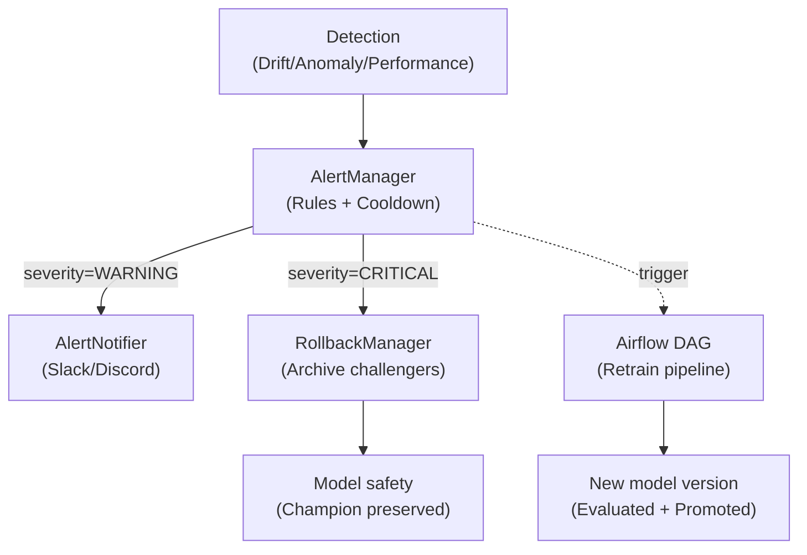

# Self-Healing ML: Automated Drift Detection and Recovery

*Phoenix ML automatically detects model degradation and recovers — no human intervention needed.*

## Problem: Model Decay

ML models degrade over time because of:

1. **Data Drift**: Production data distribution shifts from training data
2. **Concept Drift**: Relationship between features and target changes
3. **Feature Changes**: Upstream data pipeline changes schema/semantics
4. **Anomalous Events**: Black swan events (COVID, recession)

## Solution: Self-Healing Pipeline

### Detection Layer

Phoenix ML has 3 detection mechanisms running in parallel:

#### 1. Statistical Drift Detection

```python
# DriftCalculator (phoenix_ml/domain/monitoring/services/drift_calculator.py)
# 3 algorithms configurable per model:

# Kolmogorov-Smirnov test — continuous features
result = calculator.calculate_ks(reference, current)

# Population Stability Index — binned distributions
result = calculator.calculate_psi(reference, current)

# Chi-squared test — categorical features
result = calculator.calculate_chi2(reference, current)
```

**How it works**:
- Reference data = training data distribution (stored per model)
- Current data = recent N prediction features
- Score > threshold → drift detected

#### 2. Anomaly Detection

```python
# AnomalyDetector (phoenix_ml/domain/monitoring/services/anomaly_detector.py)
# Z-score: detect values exceeding 2 standard deviations
anomalies = detector.detect_zscore(latencies, threshold=2.0)

# IQR: detect outliers via interquartile range
anomalies = detector.detect_iqr(confidence_scores)
```

#### 3. Performance Monitoring

```python
# ModelEvaluator (phoenix_ml/domain/monitoring/services/model_evaluator.py)
# When ground truth is available (via /feedback endpoint):
evaluator = get_evaluator("classification")
metrics = evaluator.evaluate(predictions, ground_truths)
# → accuracy, f1, precision, recall
```

### Response Layer



#### Alert Rules

```python
AlertRule(
    name="high_drift",
    metric="drift_score",
    threshold=0.3,
    severity="CRITICAL",
    comparison="gt",
    cooldown_seconds=300,  # Avoid alert spam
)
```

**Cooldown mechanism**: Same alert won't fire again within cooldown period.

#### Automatic Rollback

When drift score > critical threshold:
1. Archive all challenger models → stage = "archived"
2. Keep champion model active → baseline safe
3. Notify via webhook → team awareness

#### Automatic Retraining

When drift triggers the self-healing pipeline:
1. **Export fresh data** — query `prediction_logs` WHERE `ground_truth IS NOT NULL`
2. **Merge with baseline** — combine labeled production data + original training data
3. **Retrain** — train model on merged dataset (fresh production distribution)
4. **Register** — deploy retrained model as challenger
5. **Verify** — post-healing performance and drift checks

```bash
# The entire lifecycle can be simulated end-to-end:
uv run python scripts/simulate_pipeline.py --fast
```

This exercises ALL 12 API endpoints:
- `POST /predict` — serve traffic
- `POST /feedback` — submit ground truth labels
- `GET /monitoring/drift/{model_id}` — detect drift
- `POST /models/rollback` — archive challengers, keep champion
- `POST /data/export-training` — export labeled logs + baseline
- `POST /models/register` — register retrained challenger
- `GET /monitoring/reports/{model_id}` — drift audit trail
- `GET /monitoring/performance/{model_id}` — performance metrics

### Monitoring Loop Architecture

```python
# lifespan.py — Background monitoring task
async def _monitoring_loop():
    while True:
        for model_id, config in model_configs.items():
            try:
                # 1. Get recent predictions
                logs = await log_repo.get_recent(model_id, limit=100)
                
                # 2. Calculate drift
                drift = drift_calculator.calculate(reference, current)
                
                # 3. Save report
                await drift_repo.save(DriftReport(...))
                
                # 4. Publish Prometheus metric
                metrics_publisher.publish_drift_score(model_id, drift.score)
                
                # 5. Check alert rules
                alerts = alert_manager.evaluate(rules, {"drift_score": drift.score})
                for alert in alerts:
                    await notifier.notify(alert)
                
                # 6. Auto-rollback if critical
                if drift.score > critical_threshold:
                    rollback_manager.evaluate_rollback(model_id, ...)
                    
            except Exception as e:
                logger.error(f"Monitoring failed for {model_id}: {e}")
        
        await asyncio.sleep(MONITORING_INTERVAL_SECONDS)
```

## Results

| Metric | Without Self-Healing | With Self-Healing |
|--------|---------------------|-------------------|
| Drift detection time | Manual (hours/days) | Automatic (30s) |
| Alert delivery | None | Instant (webhook) |
| Rollback time | Manual (hours) | Automatic (seconds) |
| Model downtime | Until human notices | Near-zero |
| Retraining trigger | Manual | Automatic |

## Key Design Decisions

1. **Per-model config**: Each model has its own drift algorithm and threshold
2. **No-op fallback**: Self-healing works even without Kafka/Redis
3. **Cooldown**: Prevents alert storm during sustained drift
4. **Champion preservation**: Rollback always keeps champion safe
5. **Observable**: All metrics exported to Prometheus → Grafana dashboards

---
*Published: March 2026*
