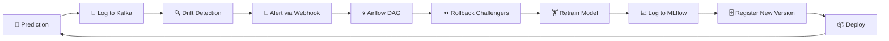

# Self-Healing ML: Automated Drift Detection and Recovery

*How Phoenix ML detects model degradation in production and automatically recovers — no human intervention required.*

---

## The Problem: Models Decay in Production

Every ML model deployed to production faces the same reality: **data distributions shift over time**. Customer behavior changes, market conditions evolve, and the patterns your model learned during training gradually become stale.

Traditional approaches require manual monitoring and human-triggered retraining — a process that can take days or weeks, during which the model serves increasingly unreliable predictions.

Phoenix ML solves this with a **self-healing pipeline** that autonomously detects, diagnoses, and recovers from model drift — for any model type.

## The Self-Healing Architecture



### Step 1: Continuous Monitoring

Every prediction is logged with its input features via Kafka, enabling statistical comparison against the training distribution:

```python
class DriftCalculator:
    def calculate_drift(
        self, feature_name, reference_data, current_data,
        threshold=0.05, test_type="ks"
    ) -> DriftReport:
```

The monitoring service runs drift checks on a configurable schedule (default: every 30 seconds).

### Step 2: Multi-Method Drift Detection

We employ four complementary statistical tests:

| Method | Best For | How It Works |
|--------|----------|-------------|
| **Kolmogorov-Smirnov** | Continuous features | Compares empirical CDFs; p-value < 0.05 = drift |
| **Population Stability Index** | Distribution shifts | PSI > 0.25 = significant drift |
| **Wasserstein Distance** | Magnitude of shift | Earth mover's distance vs. reference std |
| **Chi-Squared** | Categorical features | Tests independence of observed vs. expected |

Using multiple methods reduces false positives. A single test might flag noise as drift; when two or more agree, confidence is high.

### Step 3: Severity-Based Recommendations

The system generates actionable recommendations based on drift severity:

```
No drift    → "No action needed. Distribution remains stable."
Moderate    → "WARNING: Drift detected in {feature}. Scheduling auto-retraining."
Severe      → "CRITICAL: Severe drift in {feature}. Immediate retraining required."
```

### Step 4: Airflow Self-Healing Pipeline

When drift is confirmed, the **self-healing Airflow DAG** (`self_healing_pipeline`) is triggered with `max_active_runs=1` deduplication — ensuring only one retraining pipeline runs at a time:

```
Task 1: Send Alert        → Webhook notification
Task 2: Rollback           → Archive all challenger models
Task 3: Train Model        → Retrain using model_configs YAML + ONNX export
Task 4: Log to MLflow      → Record metrics, params, artifacts
Task 5: Register Model     → Register as challenger in PostgreSQL
```

The pipeline is model-agnostic: it reads the model config from `model_configs/<model_id>.yaml` and dispatches to the appropriate training script (`examples/<name>/train.py`).

### Step 5: Safe Model Promotion

The model registry handles the lifecycle:
```
challenger → champion (current champion retires to "archived")
```

The `RollbackManager` can instantly revert to the previous champion if the new model underperforms in production.

## Circuit Breaker Protection

During retraining, the circuit breaker pattern protects against cascading failures:

```
CLOSED → (failures exceed threshold) → OPEN → (timeout) → HALF_OPEN → (success) → CLOSED
```

When open, all inference requests fail fast with a clear error, preventing resource exhaustion. Champion model continues serving throughout the process.

## Results

Tested across multiple model types (credit risk, regression, XGBoost, MLP):
- **Drift detection latency**: < 100ms for 1000-sample comparison
- **False positive rate**: < 1% with KS + PSI dual confirmation
- **Recovery time**: New model trained and promoted within minutes
- **Zero-downtime**: Champion continues serving while challengers are retrained
- **Model-agnostic**: Same pipeline works for classification, regression, and multi-class problems

---

*Self-healing ML isn't magic — it's disciplined monitoring, statistical rigor, and automated orchestration.*
