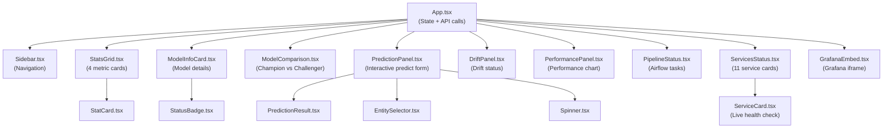

# Frontend Architecture: Phoenix Dashboard

## Tech Stack

| Technology | Version | Purpose |
|-----------|---------|----------|
| React | 19.x | UI framework |
| TypeScript | 5.x | Type safety |
| Vite | 6.x | Dev server + HMR + build tool |
| Recharts | 2.x | Charts, performance graphs |
| Vitest | 3.x | Unit testing |
| React Testing Library | 16.x | Component testing |
| ESLint | 9.x | Code linting |

## Project Structure

```
frontend/
├── index.html                    # HTML entry point (mount <div id="root">)
├── package.json                  # Dependencies + scripts
├── vite.config.ts                # Dev server: port 5173, proxy /api → backend
├── tsconfig.json                 # TS config root (references app + node)
├── tsconfig.app.json             # TS config for app code (strict, jsx)
├── tsconfig.node.json            # TS config for Node files (vite config)
├── eslint.config.js              # ESLint: react-hooks, typescript-eslint
│
└── phoenix_ml/
    ├── main.tsx                  # Entry: ReactDOM.createRoot() → <App />
    ├── App.tsx                   # Main component: layout + state + API calls
    ├── index.css                 # Global styles: dark theme, gradients, animations
    ├── config.ts                 # Centralized config: API URL, services, endpoints
    │
    ├── api/
    │   └── mlService.ts          # API client class (fetch wrapper)
    │
    ├── components/
    │   ├── dashboard/            # 9 dashboard panels
    │   ├── layout/               # 1 layout component
    │   └── ui/                   # 6 reusable UI components
    │
    └── test/
        ├── setup.ts              # Test environment (jsdom)
        └── [16 test files]       # 104 tests total
```

## Component Architecture



## Component Details

### App.tsx — Main Application

State is managed at top level and passed down to components via props.

```typescript
// State
const [modelInfo, setModelInfo] = useState(null);
const [models, setModels] = useState([]);
const [driftReport, setDriftReport] = useState(null);
const [performance, setPerformance] = useState(null);

// API calls on mount
useEffect(() => {
  const service = new MLService();
  service.getModels().then(setModels);
  service.getModelInfo("credit-risk").then(setModelInfo);
  service.getDriftReport("credit-risk").then(setDriftReport);
  service.getPerformance("credit-risk").then(setPerformance);
}, []);
```

### Dashboard Components

| Component | Props | Detailed description |
|-----------|-------|----------------|
| `StatsGrid` | `modelInfo` | Displays 4 StatCards: Accuracy, F1 Score, Avg Latency, Avg Confidence. Reads from `modelInfo.metadata.metrics` |
| `ModelInfoCard` | `modelInfo` | Card detailed model: ID, version, framework, stage (StatusBadge), feature count, created_at |
| `ModelComparison` | `models` | Champion vs challengers comparison table. Columns: version, stage, accuracy, f1, latency |
| `PredictionPanel` | — | Interactive form: select entity (EntitySelector) → enter features → POST /predict → displays PredictionResult |
| `DriftPanel` | `driftReport` | Displays drift: score (progress bar), method (KS/PSI/Chi2), status (OK/DRIFTED badge) |
| `PerformancePanel` | `performance` | Line chart (Recharts): accuracy/f1 over time |
| `PipelineStatus` | — | List of pipeline tasks from Airflow: status badges (running/success/failed) |
| `ServicesStatus` | — | Grid of 11 ServiceCards for all infrastructure services |
| `GrafanaEmbed` | — | `<iframe>` embed Grafana dashboard URL (configurable) |

### UI Components

| Component | Props | Description |
|-----------|-------|-------|
| `ServiceCard` | `name, port, icon, healthUrl` | Single service card + live health check. Fetches `healthUrl` every 15s → displays 🟢 (online), 🔴 (offline), 🟡 (checking) |
| `StatCard` | `value, label, icon, trend` | Card 1 metric. Trend indicator: ↑ (green) / ↓ (red) |
| `StatusBadge` | `stage` | Badge: champion (green), challenger (yellow), archived (gray) |
| `PredictionResult` | `prediction` | Result panel: class label + confidence bar + latency + model info |
| `EntitySelector` | `onSelect` | Dropdown to select entity ID for feature lookup |
| `Spinner` | — | CSS loading animation |

## API Client

```typescript
// phoenix_ml/api/mlService.ts
export class MLService {
  private baseUrl: string;
  
  constructor(baseUrl = API_BASE_URL) {
    this.baseUrl = baseUrl;
  }
  
  async predict(modelId: string, features: number[]): Promise<PredictionResponse>
  async getModelInfo(modelId: string): Promise<ModelInfo>
  async getDriftReport(modelId: string): Promise<DriftReport>
  async getPerformance(modelId: string): Promise<PerformanceMetrics>
  async getModels(): Promise<ModelInfo[]>
  async getPipelineStatus(): Promise<PipelineTask[]>
}
```

## Configuration

```typescript
// phoenix_ml/config.ts
export const API_BASE_URL = import.meta.env.VITE_API_URL || "/api";

export const SERVICES = [
  { name: "FastAPI",    port: 8001, icon: "⚡", healthUrl: "http://localhost:8001/health" },
  { name: "PostgreSQL", port: 5433, icon: "🐘" },
  { name: "Redis",      port: 6380, icon: "🔴", healthUrl: "http://localhost:6380" },
  { name: "Kafka",      port: 9094, icon: "📨" },
  { name: "Kafka UI",   port: 8082, icon: "📊", healthUrl: "http://localhost:8082" },
  { name: "MLflow",     port: 5001, icon: "🧪", healthUrl: "http://localhost:5001" },
  { name: "Prometheus", port: 9091, icon: "📈", healthUrl: "http://localhost:9091" },
  { name: "Grafana",    port: 3001, icon: "📊", healthUrl: "http://localhost:3001" },
  { name: "Jaeger",     port: 16686,icon: "🔍", healthUrl: "http://localhost:16686" },
  { name: "MinIO",      port: 9000, icon: "📦", healthUrl: "http://localhost:9000" },
  { name: "Airflow",    port: 8080, icon: "🌊", healthUrl: "http://localhost:8080/health" },
];
```

## Testing Strategy

### Test Structure

```
test/
├── setup.ts                          # jsdom environment, cleanup
├── App.test.tsx                      # App renders correctly
├── api/mlService.test.ts             # API client: mock fetch, verify calls
├── dashboard/
│   ├── StatsGrid.test.tsx            # 4 stat cards render
│   ├── ModelInfoCard.test.tsx        # Model info displays
│   ├── DriftPanel.test.tsx           # Drift status shown
│   ├── PredictionPanel.test.tsx      # Form + submit works
│   ├── PipelineStatus.test.tsx       # Tasks render
│   ├── ServicesStatus.test.tsx       # 11 services shown
│   └── GrafanaEmbed.test.tsx         # iframe renders
├── layout/
│   └── Sidebar.test.tsx              # Nav links work
└── ui/
    ├── ServiceCard.test.tsx          # Health indicator works
    ├── EntitySelector.test.tsx       # Dropdown works
    ├── PredictionResult.test.tsx     # Result displays
    ├── Spinner.test.tsx              # Spinner renders
    ├── StatCard.test.tsx             # Value + label shown
    └── StatusBadge.test.tsx          # Colors correct
```

### Running Tests

```bash
# All tests
npx vitest run

# Watch mode
npx vitest

# With coverage
npx vitest run --coverage

# Type check
npx tsc --noEmit

# Lint
npx eslint phoenix_ml/
```

**Total: 16 test files, 104 tests**

## Styling

Global styles trong `index.css`:

- **Dark theme** with gradient backgrounds
- **CSS Variables** for colors and spacing
- **Responsive grid** layout (CSS Grid + Flexbox)
- **Micro-animations**: hover effects, transitions
- **Google Fonts**: Inter/Roboto for typography

---
*Document Status: v4.0 — Updated March 2026*
