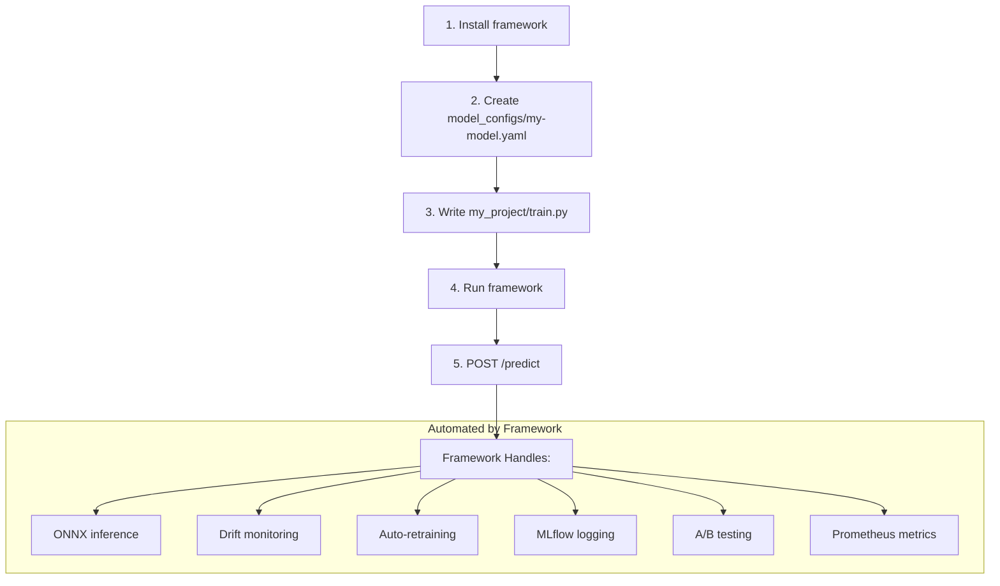

# Getting Started — Build Your ML System with Phoenix ML

Step-by-step guide to building a production ML system with the Phoenix ML framework for **your use case**.

!!! info "You only need 2 things"
    1. **YAML config** — Define your use case
    2. **Training script** — Train + export ONNX

    The framework handles the rest: inference, monitoring, drift detection, auto-retrain, A/B testing, logging.

---

## Overview: User Flow



---

## Step 1: Install

```bash
# Clone repo + install
git clone https://github.com/vtnguyen04/phoenix_ML.git
cd phoenix_ML
uv sync   # or pip install -e .
```

---

## Step 2: Define Your Use Case (YAML Config)

Create file `model_configs/<model-id>.yaml`:

### Config Structure

```yaml
# ── REQUIRED ──────────────────────────────
model_id: my-model              # Unique ID
version: v1
framework: onnx                 # onnx | tensorrt | triton
task_type: classification       # classification | regression | object_detection | nlp | custom
model_path: models/my_model/v1/model.onnx
train_script: my_project/train.py

# ── FEATURES (leave empty if raw input) ────
feature_names:
  - feature_1
  - feature_2

# ── DATA SOURCE ──────────────────────────
data_source:
  type: file                    # file | database | dvc
  # type: database → add:
  #   query: "SELECT * FROM features WHERE ..."
  #   connection: "my_postgres"
  # type: dvc → add:
  #   path: data/images/

# ── RETRAIN STRATEGY ─────────────────────
retrain:
  trigger: drift                # drift | manual | data_change | scheduled
  # trigger: scheduled → add:
  #   schedule: "0 0 * * 0"    # Cron expression
  drift_detection: true         # false for object_detection, NLP

# ── MONITORING ───────────────────────────
monitoring:
  drift_test: ks                # ks | psi | wasserstein | chi2
  primary_metric: accuracy      # accuracy | rmse | f1_score | map
```

---

## Step 3: Write Training Script

Framework requires 1 function: `train_and_export(output_path, **kwargs)`

```python
# my_project/train.py
def train_and_export(output_path, metrics_path=None, data_path=None):
    """Train model and export to ONNX.

    Args:
        output_path: Path to save model.onnx
        metrics_path: (Optional) Path to save metrics.json
        data_path: (Optional) Path to training data
    """
    import json
    import pandas as pd
    from sklearn.linear_model import LogisticRegression
    from skl2onnx import convert_sklearn
    from skl2onnx.common.data_types import FloatTensorType
    from pathlib import Path

    # 1. Load data
    df = pd.read_csv(data_path or "data/my_model/dataset.csv")
    X = df.drop("label", axis=1).values
    y = df["label"].values

    # 2. Train
    model = LogisticRegression()
    model.fit(X, y)

    # 3. Export ONNX
    initial_type = [("input", FloatTensorType([None, X.shape[1]]))]
    onnx_model = convert_sklearn(model, initial_types=initial_type)
    Path(output_path).parent.mkdir(parents=True, exist_ok=True)
    with open(output_path, "wb") as f:
        f.write(onnx_model.SerializeToString())

    # 4. Save metrics (optional, used for MLflow logging)
    if metrics_path:
        metrics = {"accuracy": float(model.score(X, y)), "n_samples": len(y)}
        with open(metrics_path, "w") as f:
            json.dump(metrics, f)
```

---

## Step 4: Run Framework

### Option A: Docker Compose (recommended)

```bash
# Start all stack: API, PostgreSQL, Redis, Kafka, MLflow, Airflow, Grafana
docker compose up -d

# View logs
docker compose logs -f api
```

### Option B: Local (dev)

```bash
# Run server directly
uv run python -m src.infrastructure.http.fastapi_server
# → http://localhost:8000
```

---

## Step 5: Use API

### Predict

```bash
# Single prediction
curl -X POST http://localhost:8000/predict \
  -H "Content-Type: application/json" \
  -d '{"model_id": "my-model", "features": [1.5, 2.3, 0.7]}'

# Response:
# {"result": 1, "confidence": 0.92, "model_version": "v1", "latency_ms": 12.5}
```

### Batch Predict

```bash
curl -X POST http://localhost:8000/predict/batch \
  -H "Content-Type: application/json" \
  -d '{
    "model_id": "my-model",
    "batch": [
      {"features": [1.5, 2.3, 0.7]},
      {"features": [0.8, 1.1, 2.4]}
    ]
  }'
```

### Manual Retrain

```bash
curl -X POST http://localhost:8000/models/my-model/retrain
# → Triggers Airflow DAG to retrain your model
```

### Check Drift

```bash
curl http://localhost:8000/monitoring/drift/my-model

# View drift history
curl http://localhost:8000/monitoring/reports/my-model

# Export fresh data for retrain
curl -X POST http://localhost:8000/data/export-training \
  -H "Content-Type: application/json" \
  -d '{"model_id": "my-model", "min_samples": 10, "include_baseline": true}'

# Rollback challengers
curl -X POST http://localhost:8000/models/rollback \
  -H "Content-Type: application/json" \
  -d '{"model_id": "my-model", "reason": "Manual rollback"}'
```

---

## Practical Examples

### Example 1: Sentiment Analysis

```yaml
# model_configs/sentiment.yaml
model_id: sentiment
version: v1
framework: onnx
task_type: classification
model_path: models/sentiment/v1/model.onnx
train_script: examples/sentiment/train.py
data_path: data/sentiment/reviews.csv
dataset_name: product-reviews

feature_names:
  - text_length
  - avg_word_length
  - positive_word_count
  - negative_word_count
  - exclamation_count
  - question_count
  - capital_ratio
  - tfidf_0
  - tfidf_1
  - tfidf_2
  # ... (TF-IDF or embedding features)

data_source:
  type: file

retrain:
  trigger: scheduled
  schedule: "0 0 * * 0"       # Every Sunday
  drift_detection: true

monitoring:
  drift_test: psi
  primary_metric: f1_score
```

**User app preprocessing:**

```python
# Client-side: text → features → API call
import httpx

def predict_sentiment(text: str) -> dict:
    features = extract_features(text)  # TF-IDF, word counts, etc.
    resp = httpx.post("http://localhost:8000/predict", json={
        "model_id": "sentiment",
        "features": features
    })
    return resp.json()
    # → {"result": 1, "confidence": 0.94}  ← 1 = positive

predict_sentiment("Great product, fast delivery!")
```

---

### Example 2: Product Recommendation

```yaml
# model_configs/product-recommend.yaml
model_id: product-recommend
version: v1
framework: onnx
task_type: regression
model_path: models/product_recommend/v1/model.onnx
train_script: examples/recommendation/train.py
data_path: data/recommend/interactions.csv

feature_names:
  - user_age
  - user_purchase_count
  - user_avg_spend
  - item_category
  - item_price
  - item_rating
  - user_item_similarity
  - days_since_last_purchase

data_source:
  type: database
  query: "SELECT * FROM user_item_features WHERE created_at > '{{last_train_date}}'"
  connection: main_postgres

retrain:
  trigger: drift
  drift_detection: true

monitoring:
  drift_test: wasserstein
  primary_metric: rmse
```

**User app:**

```python
# Get recommendation score for user + item
resp = httpx.post("http://localhost:8000/predict", json={
    "model_id": "product-recommend",
    "features": [25, 12, 150.0, 3, 299.99, 4.5, 0.85, 7]
})
score = resp.json()["result"]  # 0.92 → highly relevant
```

---

## Retrain Triggers — Details

| Trigger | When to use | How it works |
|---------|-------------|----------------|
| `drift` | Tabular data, production traffic | Framework auto-detects drift → triggers Airflow DAG |
| `manual` | When user wants full control | `POST /models/{id}/retrain` or Airflow UI |
| `data_change` | DVC datasets (images, text corpora) | DAG checks `dvc status` every 6h → retrains if data changed |
| `scheduled` | Periodic retrain | Cron expression: `"0 0 * * 0"` = every Sunday |

---

## Setup DVC (for large datasets)

If your use case needs to version large data (images, text corpora):

```bash
# 1. Init DVC
dvc init

# 2. Config remote storage (MinIO, S3, GCS)
dvc remote add -d storage s3://my-bucket/dvc-data
dvc remote modify storage endpointurl http://minio:9000

# 3. Track dataset
dvc add data/my_dataset/
git add data/my_dataset.dvc .gitignore

# 4. Push data
dvc push

# 5. Set model config:
#    data_source.type: dvc
#    retrain.trigger: data_change
```

---

## Monitoring Dashboard

After deployment, access:

| Service | URL | Function |
|---------|-----|-----------|
| **API** | `http://localhost:8001/docs` | Swagger UI |
| **Grafana** | `http://localhost:3001` | Metrics dashboards |
| **MLflow** | `http://localhost:5001` | Experiment tracking |
| **Airflow** | `http://localhost:8080` | Pipeline management |
| **Frontend** | `http://localhost:5174` | React dashboard |

---

## FAQ

**Q: What ML frameworks does it support?**
Any framework that can export ONNX: scikit-learn, XGBoost, LightGBM, PyTorch, TensorFlow, Keras.

**Q: What is the input format?**
Array of floats: `[f1, f2, f3, ...]`. User handles preprocessing (text → TF-IDF, image → embedding, etc.) before calling API.

**Q: Can I run multiple models simultaneously?**
Yes. Each YAML config = 1 model. Framework loads all model configs at startup.

**Q: How does auto-retraining work?**
Framework detects drift → exports fresh labeled data from prediction_logs → merges with baseline → retrains on new distribution → registers challenger → compares with champion.

**Q: How many models are included?**
5 examples: credit-risk, fraud-detection, house-price, image-classification, sentiment.
