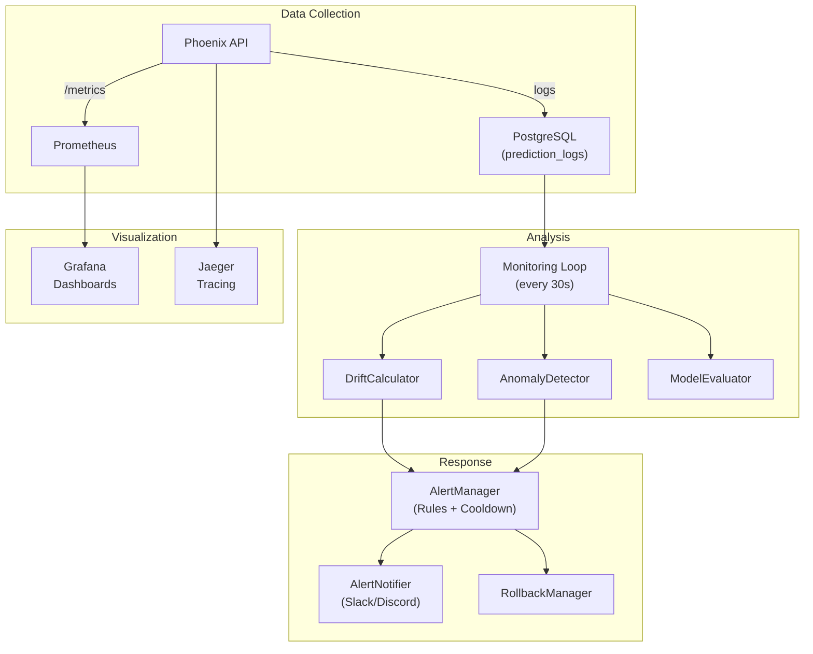
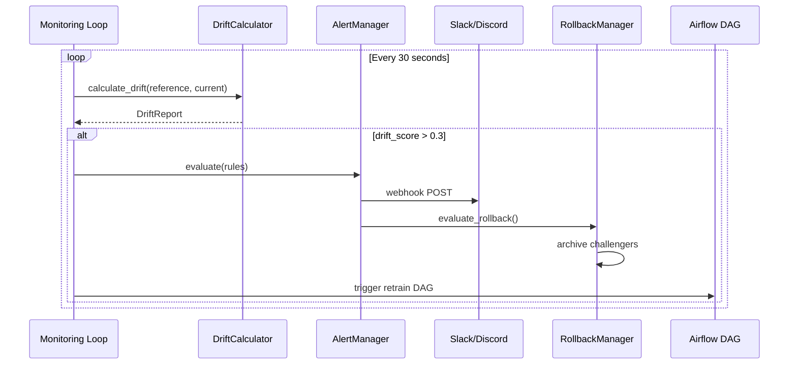

# Monitoring & Alerting Guide

Hướng dẫn chi tiết hệ thống monitoring, drift detection, anomaly detection, alerting, và self-healing.

## Tổng quan



## Drift Detection

### Algorithms

Phoenix ML supports 3 drift detection algorithms, configurable per model:

#### 1. Kolmogorov-Smirnov Test (`ks`)

**Khi nào dùng**: Continuous features, general purpose

```python
from src.domain.monitoring.services.drift_calculator import DriftCalculator

calc = DriftCalculator()
result = calc.calculate_ks(
    reference=[0.1, 0.2, 0.15, 0.3, 0.25],   # training data distribution
    current=[0.5, 0.6, 0.55, 0.7, 0.65]       # production data distribution
)
# DriftResult(score=1.0, is_drifted=True)
```

**Nguyên lý**: So sánh 2 cumulative distribution functions. Score = max distance giữa 2 CDFs.

| Score | Interpretation |
|-------|---------------|
| 0.0 - 0.1 | No drift |
| 0.1 - 0.3 | Moderate drift |
| > 0.3 | Significant drift (default threshold) |

#### 2. Population Stability Index (`psi`)

**Khi nào dùng**: Binned distributions, fraud detection

```python
result = calc.calculate_psi(reference, current)
```

**Nguyên lý**: Chia data thành bins, so sánh tỷ lệ của mỗi bin giữa reference và current.

| PSI | Interpretation |
|-----|---------------|
| < 0.1 | No shift |
| 0.1 - 0.25 | Moderate shift |
| > 0.25 | Significant shift |

#### 3. Chi-squared Test (`chi2`)

**Khi nào dùng**: Categorical features

```python
result = calc.calculate_chi2(reference, current)
```

**Nguyên lý**: So sánh observed vs expected frequencies. High chi2 = significant difference.

### Cấu hình Drift Detection

Per-model trong `model_configs/<model>.yaml`:

```yaml
# model_configs/credit-risk.yaml
monitoring:
  drift_test: ks           # Algorithm
  drift_threshold: 0.3     # Threshold cho alert
```

Global trong `.env`:

```bash
MONITORING_INTERVAL_SECONDS=30   # Check frequency
DRIFT_THRESHOLD=0.3              # Default threshold
```

### Monitoring Loop

`MonitoringService` chạy background loop trong `lifespan.py`:

```python
# Mỗi MONITORING_INTERVAL_SECONDS:
for model_id in all_models:
    # 1. Get recent prediction logs
    logs = await log_repo.get_recent(model_id, limit=100)
    
    # 2. Get reference data
    reference = load_reference_data(model_id)
    
    # 3. Calculate drift
    drift = calculator.calculate(reference, current_features)
    
    # 4. Save report
    await drift_repo.save(DriftReport(...))
    
    # 5. Publish metrics
    metrics_publisher.publish_drift_score(model_id, drift.score)
    
    # 6. Check alerts
    if drift.is_drifted:
        event_bus.publish(DriftDetected(model_id, drift.score))
```

## Anomaly Detection

### Z-Score Method

```python
from src.domain.monitoring.services.anomaly_detector import AnomalyDetector

detector = AnomalyDetector()
values = [10, 12, 11, 13, 100, 12, 11]  # 100 is anomaly
anomalies = detector.detect_zscore(values, threshold=2.0)
# Returns indices: [4]
```

### IQR Method

```python
anomalies = detector.detect_iqr(values)
# Uses Interquartile Range: Q1 - 1.5*IQR to Q3 + 1.5*IQR
```

## Alerting System

### Alert Rules

```python
from src.domain.monitoring.services.alert_manager import AlertManager, AlertRule

rules = [
    AlertRule(
        name="high_drift_score",
        metric="drift_score",
        threshold=0.3,
        severity="CRITICAL",       # INFO, WARNING, CRITICAL
        comparison="gt",           # gt (greater than), lt (less than)
        cooldown_seconds=300,      # Don't re-alert for 5 minutes
    ),
    AlertRule(
        name="low_model_accuracy",
        metric="accuracy",
        threshold=0.85,
        severity="WARNING",
        comparison="lt",
        cooldown_seconds=600,
    ),
    AlertRule(
        name="high_latency",
        metric="latency_p99",
        threshold=100,             # ms
        severity="WARNING",
        comparison="gt",
    ),
]
```

### Alert Notifier (Webhooks)

```python
from src.infrastructure.monitoring.alert_notifier import AlertNotifier

notifier = AlertNotifier(webhook_url="https://hooks.slack.com/services/xxx")
await notifier.notify(alert)
```

Payload format (Slack-compatible):

```json
{
  "blocks": [
    {
      "type": "header",
      "text": {"type": "plain_text", "text": "🚨 Phoenix ML Alert"}
    },
    {
      "type": "section",
      "fields": [
        {"type": "mrkdwn", "text": "*Alert:* high_drift_score"},
        {"type": "mrkdwn", "text": "*Severity:* CRITICAL"},
        {"type": "mrkdwn", "text": "*Model:* credit-risk"},
        {"type": "mrkdwn", "text": "*Value:* 0.45"}
      ]
    }
  ]
}
```

## Model Evaluation

### Classification Metrics

```python
from src.domain.monitoring.services.model_evaluator import get_evaluator

evaluator = get_evaluator("classification")
metrics = evaluator.evaluate(predictions, ground_truth)
# Returns: {"accuracy": 0.95, "f1_score": 0.93, "precision": 0.94, "recall": 0.92}
```

### Regression Metrics

```python
evaluator = get_evaluator("regression")
metrics = evaluator.evaluate(predictions, ground_truth)
# Returns: {"rmse": 0.15, "mae": 0.12, "r2": 0.95}
```

## Auto-Rollback

```python
from src.domain.monitoring.services.rollback_manager import RollbackManager

rollback_manager = RollbackManager()
decision = rollback_manager.evaluate_rollback(
    model_id="credit-risk",
    current_accuracy=0.72,      # Below threshold
    threshold=0.85,
    champion_version="v1",
    challenger_versions=["v2", "v3"]
)
# decision.should_rollback = True
# Action: archive v2, v3 → keep v1 as champion
```

## Prometheus Metrics

### Available Metrics

| Metric | Type | Prometheus Query Example |
|--------|------|------------------------|
| `phoenix_prediction_count` | Counter | `rate(phoenix_prediction_count[5m])` |
| `phoenix_inference_latency_ms` | Histogram | `histogram_quantile(0.99, phoenix_inference_latency_ms_bucket)` |
| `phoenix_drift_score` | Gauge | `phoenix_drift_score{model_id="credit-risk"}` |
| `phoenix_model_accuracy` | Gauge | `phoenix_model_accuracy{model_id="credit-risk"}` |
| `phoenix_drift_detected_total` | Counter | `increase(phoenix_drift_detected_total[1h])` |

### PromQL Examples

```promql
# P99 latency over last 5 minutes
histogram_quantile(0.99, rate(phoenix_inference_latency_ms_bucket[5m]))

# Requests per second
rate(phoenix_prediction_count[1m])

# Drift trend
phoenix_drift_score{model_id="credit-risk"}

# Error rate
rate(phoenix_prediction_count{status="error"}[5m]) / rate(phoenix_prediction_count[5m])
```

## Grafana Dashboards

Access: `http://localhost:3001` (admin/admin)

### Auto-provisioned Dashboard

Dashboard `phoenix-ml.json` bao gồm:

| Panel | Type | Query |
|-------|------|-------|
| Prediction Rate | Time series | `rate(phoenix_prediction_count[5m])` |
| Latency Distribution | Histogram | `phoenix_inference_latency_ms` |
| Drift Score | Gauge + Time series | `phoenix_drift_score` |
| Model Accuracy | Gauge | `phoenix_model_accuracy` |
| F1 Score | Gauge | `phoenix_model_f1_score` |
| Active Models | Stat | Count of models |

## Distributed Tracing (Jaeger)

Access: `http://localhost:16686`

### Setup

```python
# Tự động initialize trong lifespan.py
from src.infrastructure.monitoring.tracing import init_tracing
init_tracing()  # OTLP exporter → Jaeger
```

### Trace Attributes

Mỗi prediction request tạo trace với spans:

```
[predict] 5.2ms
  ├── [resolve_model] 0.1ms
  ├── [get_features] 0.8ms
  ├── [inference] 3.5ms
  └── [publish_events] 0.5ms
```

## Self-Healing Pipeline

### Full Flow



### Manual Trigger

```bash
# Trigger drift check manually
curl http://localhost:8001/monitoring/drift/credit-risk

# View drift history
curl http://localhost:8001/monitoring/reports/credit-risk?limit=20

# Rollback model
curl -X POST http://localhost:8001/models/rollback -d '{"model_id": "credit-risk"}'
```

---
*Document Status: v4.0 — Updated March 2026*
