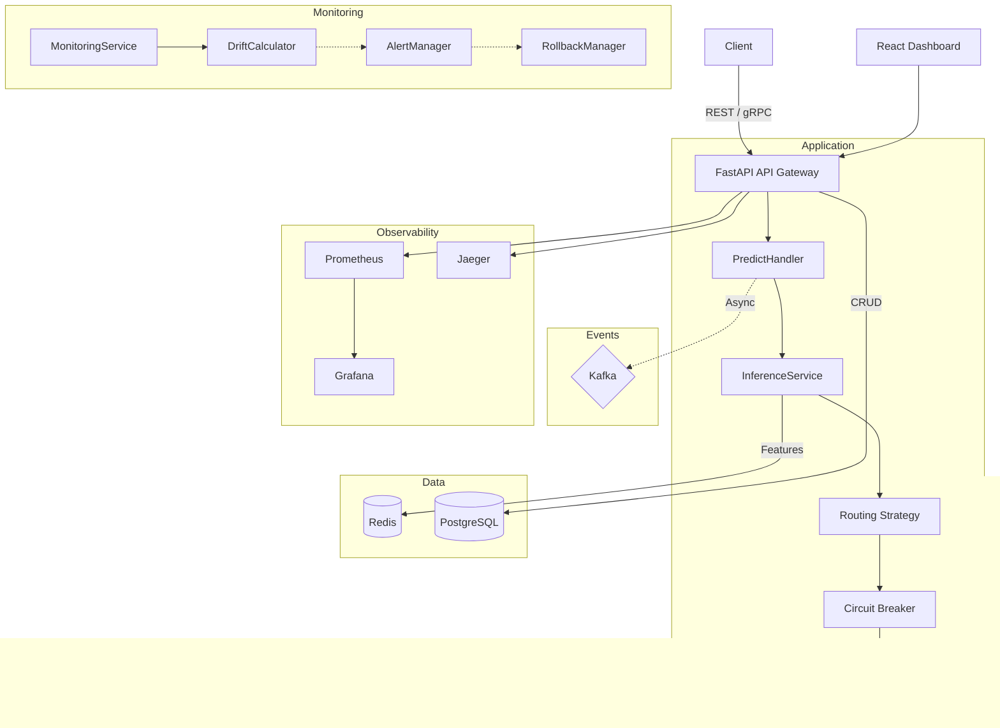

# Phoenix ML Platform Documentation

Technical documentation for the **Phoenix ML Platform** — a self-healing, model-agnostic real-time ML inference system built with Domain-Driven Design and Clean Architecture.

## What is Phoenix ML?

Phoenix ML là một nền tảng **MLOps end-to-end** cho phép:

- **Real-time Inference**: Serving ML models qua REST API và gRPC với latency < 10ms
- **Model-Agnostic**: Hỗ trợ bất kỳ model nào export sang ONNX (classification, regression, image, NLP)
- **Self-Healing**: Tự động phát hiện data drift, anomaly → alert → rollback model
- **Multi-Model Management**: Champion/Challenger, A/B Testing, Canary Deployment, Shadow Mode
- **Full Observability**: Prometheus metrics, Grafana dashboards, Jaeger distributed tracing
- **Event-Driven**: Kafka for async event streaming, real-time prediction logging
- **Automated Retraining**: Airflow DAGs tự động retrain khi phát hiện drift

## Tech Stack

| Layer | Technologies |
|-------|-------------|
| **Backend API** | Python 3.13, FastAPI, gRPC, Uvicorn |
| **ML Runtime** | ONNX Runtime, TensorRT, Triton Inference Server |
| **Frontend** | React 19, TypeScript, Vite, Recharts |
| **Database** | PostgreSQL 15 (async via SQLAlchemy 2.0) |
| **Cache/Features** | Redis (online feature store) |
| **Messaging** | Apache Kafka (KRaft mode) |
| **Model Registry** | MLflow Tracking Server |
| **Artifact Storage** | MinIO (S3-compatible) |
| **Monitoring** | Prometheus + Grafana + Jaeger |
| **Pipeline** | Apache Airflow |
| **Deployment** | Docker Compose, Kubernetes (Helm) |
| **CI/CD** | GitHub Actions |
| **Quality** | Ruff (lint), Mypy (type check), pytest, Vitest, ESLint |

## Architecture at a Glance


```mermaid
graph TD
    Client[Client] -->|REST / gRPC| API[FastAPI API Gateway]
    
    subgraph "Application"
        API --> PH[PredictHandler]
        PH --> IS[InferenceService]
        IS --> Router[Routing Strategy]
        Router --> CB[Circuit Breaker]
        CB --> Engine[ONNX / TensorRT / Triton]
    end
    
    subgraph "Data"
        IS -->|Features| Redis[(Redis)]
        API -->|CRUD| PG[(PostgreSQL)]
    end
    
    subgraph "Events"
        PH -.->|Async| Kafka{Kafka}
    end
    
    subgraph "Monitoring"
        Monitor[MonitoringService] --> Drift[DriftCalculator]
        Drift -.-> Alert[AlertManager]
        Alert -.-> Rollback[RollbackManager]
    end
    
    subgraph "Observability"
        API --> Prometheus
        Prometheus --> Grafana
        API --> Jaeger
    end
    
    Dashboard[React Dashboard] --> API
```

## Documentation Sections

### 🏗 Architecture

- **[System Design](architecture/system-design.md)** — Full architecture: layer structure, data flow, infrastructure services, design patterns, self-healing flow
- **[DDD Overview](architecture/ddd-overview.md)** — Bounded contexts, entities, value objects, domain services, repository interfaces, CQRS, event sourcing
- **[Frontend Architecture](frontend/architecture.md)** — React dashboard: components, state management, API integration, testing strategy

### 📡 API & Deployment

- **[API Reference](api/reference.md)** — All REST endpoints: inference, batch prediction, model management, drift monitoring, feature store
- **[Deployment Guide](deployment/docker-stack.md)** — Docker Compose stack (14+ services), Kubernetes Helm chart, environment config

### 📚 Guides

- **[Library API Guide](guides/library-api.md)** — Use Phoenix ML as a Python library: programmatic inference, model loading, feature retrieval
- **[Customization Guide](guides/customization.md)** — Add models, implement custom engines/plugins, configure alerts, extend data loaders
- **[Monitoring & Alerting](guides/monitoring.md)** — Drift detection algorithms, anomaly detection, Prometheus metrics, Grafana dashboards, webhook alerts
- **[Troubleshooting](guides/troubleshooting.md)** — Common issues, error reference, debug commands, port mapping
- **[Contributing](../CONTRIBUTING.md)** — Development setup, branching strategy, code standards, PR checklist

### 📋 Architecture Decision Records

| # | Decision | Status |
|---|----------|--------|
| [001](adr/001-use-ddd-architecture.md) | Domain-Driven Design + Clean Architecture | ✅ Accepted |
| [002](adr/002-use-onnx-runtime.md) | ONNX Runtime as unified inference engine | ✅ Accepted |
| [003](adr/003-use-kafka-for-event-streaming.md) | Apache Kafka for event streaming | ✅ Accepted |
| [004](adr/004-observability-with-prometheus-grafana.md) | Prometheus + Grafana for observability | ✅ Accepted |

### 📝 Blog Posts

- **[System Design Overview](blog/system-design-overview.md)** — Architecture decisions deep dive
- **[Self-Healing ML](blog/self-healing-ml.md)** — Automated drift detection and model recovery
- **[Performance Optimization](blog/performance-optimization.md)** — Latency, throughput, and batching engineering

## Quick Start

```bash
# Clone and setup
git clone https://github.com/vtnguyen04/phoenix_ML.git
cd phoenix_ML && cp .env.example .env

# Start all services
docker compose up -d
docker compose -f docker-compose.airflow.yaml up -d

# Train all models
uv run python scripts/generate_datasets.py
uv run python examples/credit_risk/train.py
uv run python examples/house_price/train.py

# Access
# API:       http://localhost:8000/docs
# Frontend:  http://localhost:5174
# MLflow:    http://localhost:5001
# Grafana:   http://localhost:3001
# Airflow:   http://localhost:8080
```

## Project Stats

| Metric | Value |
|--------|-------|
| Source files | 145+ Python, 30+ TypeScript |
| Test files | 60 backend + 16 frontend = 76 total |
| Test coverage | 87% backend |
| Lint/Type check | Ruff 0 errors, Mypy 0 errors, ESLint 0 errors, TSC 0 errors |
| Docker services | 14 containers |
| Models supported | 4 (credit-risk, fraud-detection, house-price, image-classification) |

---
*Repository: [phoenix_ML](https://github.com/vtnguyen04/phoenix_ML) · Author: Võ Thành Nguyễn*