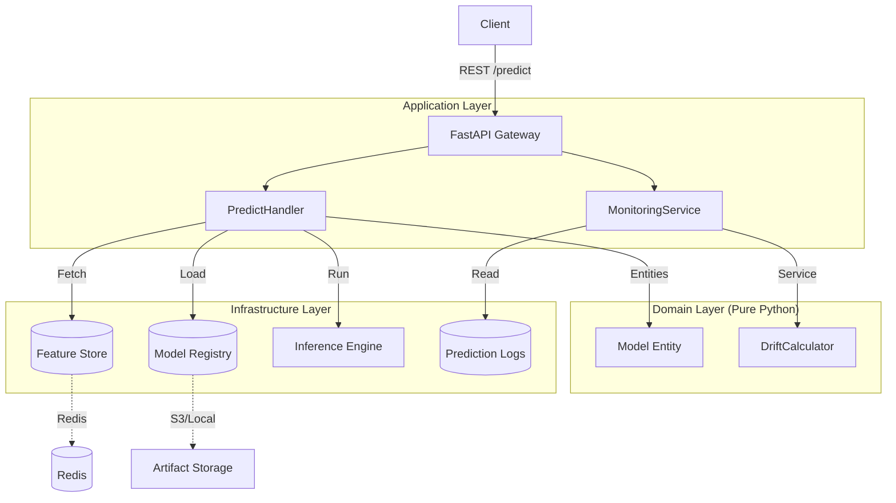

# Phoenix ML Platform

High-Throughput, Low-Latency Real-time ML Inference System built with Domain-Driven Design (DDD), SOLID principles, and Production-Grade MLOps practices.

## System Architecture

Phoenix Platform is designed to separate Business Logic (Domain) from Infrastructure, ensuring scalability and maintainability.



## Key Features

*   **Clean Architecture (DDD)**: Strict separation of concerns. `Domain` layer has ZERO dependencies on frameworks.
*   **Real-time Feature Store**: Integrated with Redis for low-latency feature retrieval (<5ms).
*   **Self-Healing & Monitoring**:
    *   **Drift Detection**: Automated Kolmogorov-Smirnov (KS) tests on production data.
    *   **Async Logging**: Non-blocking logging using background tasks.
*   **Production Engineering**:
    *   **Multi-stage Docker Builds**: Optimized image size (<200MB).
    *   **Config Management**: Environment-based configuration (12-factor app).
    *   **Strict Quality Gates**: `ruff` (linting), `mypy` (strict typing), `pytest` (90%+ coverage).

## Documentation

The system is documented in detail:

*   **[System Design](architecture/system-design.md)**: Detailed data flow and layer design.
*   **Architecture Decision Records (ADRs)**:
    *   [ADR 001: DDD Architecture](adr/001-use-ddd-architecture.md)
    *   [ADR 002: ONNX Runtime](adr/002-use-onnx-runtime.md)
*   **API Specs**: Automatically generated by FastAPI at `/docs`.

## Quick Start

### Prerequisites
* Docker & Docker Compose
* Or Python 3.11+ (with `uv` or `pip`)

### Option 1: Run with Docker (Recommended)

```bash
# 1. Start the stack (API + Redis)
docker compose up -d --build

# 2. Check health
curl http://localhost:8000/health
```

### Option 2: Run Locally

```bash
# 1. Install dependencies
uv sync

# 2. Run server (uses In-Memory Redis fallback)
uv run python -m src.infrastructure.http.fastapi_server
```

## Demo Scenario

We have included a `demo.sh` script to simulate a real-world usage scenario:

1.  **Health Check**: Ensure system is up.
2.  **Prediction**: Send a request using Feature Store (no features in payload).
3.  **Traffic Simulation**: Send 50+ requests to generate data.
4.  **Drift Detection**: Analyze the traffic against a reference distribution.

```bash
chmod +x demo.sh
./demo.sh
```

## Project Structure

```text
src/
├── domain/                  # CORE LOGIC (No ext. dependencies)
│   ├── inference/           # Model, Prediction Entities
│   ├── feature_store/       # FeatureStore Interface
│   └── monitoring/          # Drift Calculation Logic
├── application/             # ORCHESTRATION
│   ├── handlers/            # Use Cases (Predict, Retrain)
│   └── services/            # Monitoring Service
├── infrastructure/          # ADAPTERS
│   ├── http/                # FastAPI Server
│   ├── feature_store/       # Redis Implementation
│   └── persistence/         # In-Memory Repositories
└── config.py                # Configuration
```

---

**Author:** VÕ Thành nguyễn
**Email:** nguyenvothanh04@gmail.com